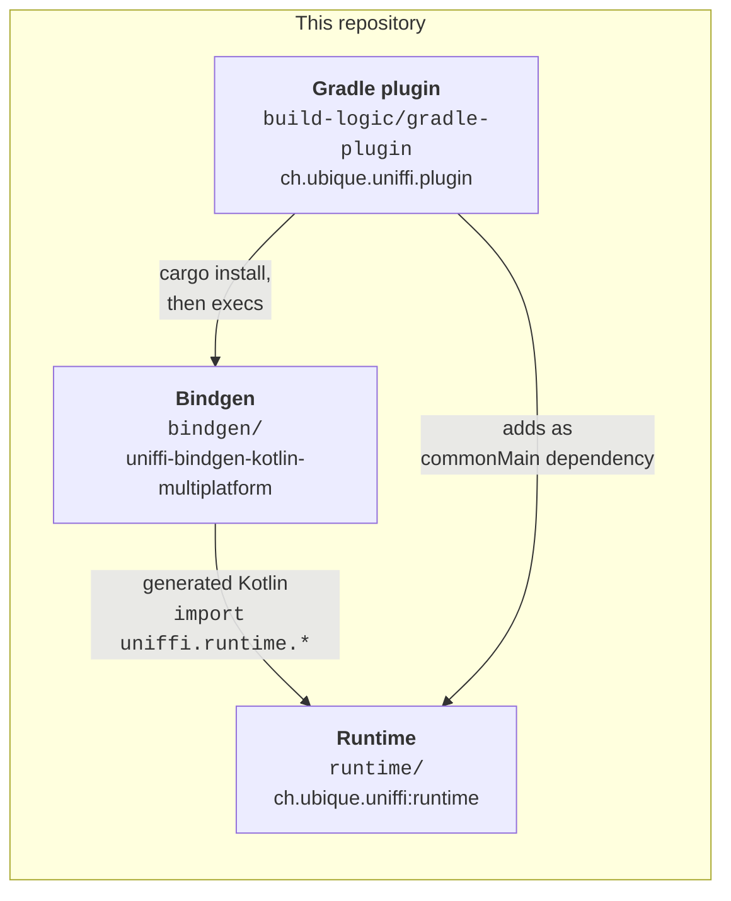
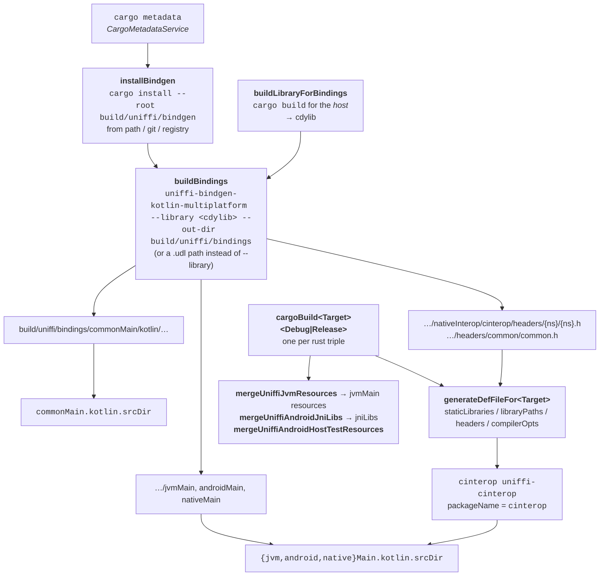
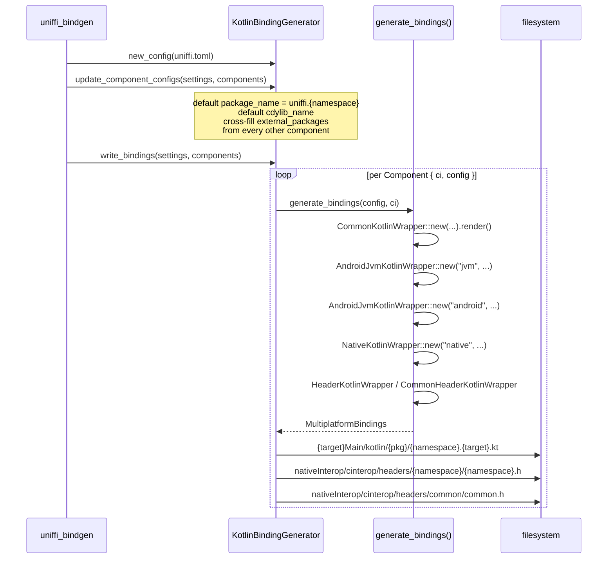
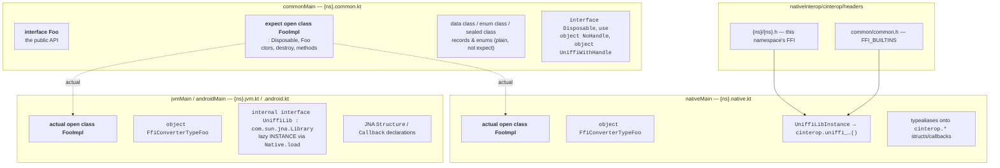
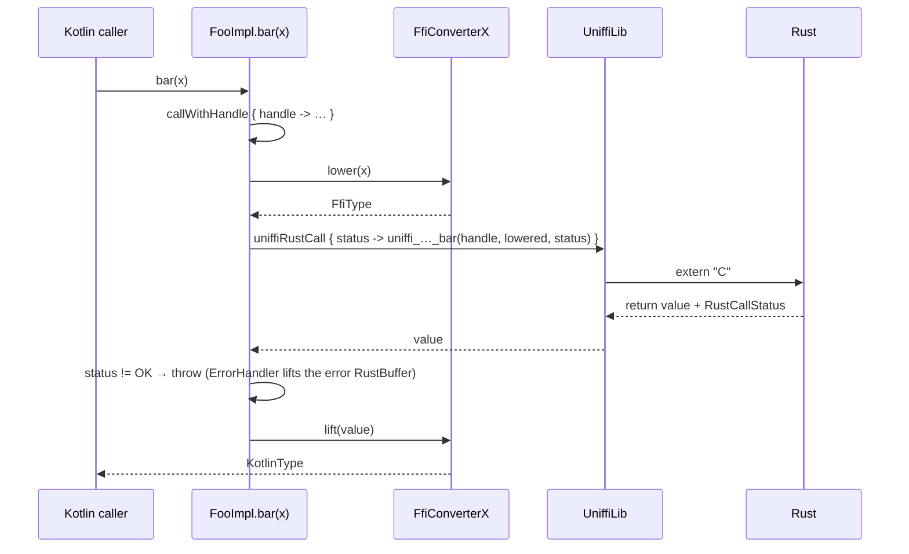

# Architecture: how the bindings are generated

## 1. The three components



| Component | What it is | Where |
| --- | --- | --- |
| Gradle plugin | Orchestrates everything: installs the bindgen, builds the Rust crate per target, runs the bindgen, wires generated sources/headers/libraries into the KMP source sets. | `build-logic/gradle-plugin/src/main/kotlin/ch/ubique/uniffi/plugin/` |
| Bindgen | A `uniffi_bindgen::BindingGenerator` implementation plus askama templates. Produces Kotlin for four source sets and two C headers. | `bindgen/src/` |
| Runtime | Hand-written Kotlin published to Maven Central. Holds everything the generated code needs that does not depend on the specific crate: `FfiConverter`, `RustBuffer`, `ByteBuffer`, `UniffiHandleMap`, `UniffiCleaner`, the async helpers, per-primitive converters. | `runtime/src/{commonMain,jvmMain,androidMain,nativeMain}/kotlin/uniffi/runtime/` |

## 2. The build pipeline



Task names live in `Constants.kt` (`object Tasks`); the wiring is `UniffiPlugin.apply()`.

Points worth knowing:

- **Two different cargo builds.** `buildLibraryForBindings` builds a *host* cdylib whose only
  purpose is to be read by the bindgen (uniffi's library mode extracts proc-macro metadata from
  the binary). The per-target `cargoBuild*` tasks build what actually ships — dynamic libraries
  for JVM/Android, static libraries for Kotlin/Native.
- **UDL mode vs library mode.** `uniffi { generateFromLibrary() }` or `generateFromUdl { … }`
  selects which; `BuildBindingsTask.buildBindings()` builds `--library <path>` or a bare UDL path
  accordingly. `generateBindingsForExternalCrates` (default `false`) decides whether `--crate
  <name>` is appended, which limits generation to the target crate.
- **IDE sync.** When `idea.sync.active` is set the plugin skips the native cargo builds and emits
  a dummy def file (`GenerateDummyDefFileTask`), so an IDE import does not trigger a full
  cross-compile.
- **cinterop commonization is mandatory.** The generated `nativeMain` sources reference the
  `cinterop` package from a *shared* source set, which only resolves with
  `kotlin.mpp.enableCInteropCommonization=true`. The plugin fails the build in `afterEvaluate`
  with that message if `commonizeCInterop` is absent.
- **Duplicate-symbol workaround.** `GenerateDefFileTask.duplicateSymbolOpt()` adds
  `--allow-multiple-definition` on linux/mingw, because two uniffi modules sharing a Rust
  dependency each carry that dependency's scaffolding symbols in their own staticlib. The
  `#[no_mangle]` scaffolding symbols collapse cleanly; the Rust-mangled ones do not always, which is
  the root of the Kotlin/Native callback-vtable limitation — see
  [deep-dive.md §7.4](deep-dive.md#74-why-kotlinnative-breaks-the-cell-symbol).
- **One cargo invocation per module.** `cargoBuild*` runs `cargo build --package <name>` for each
  Gradle module separately, so each resolves its own feature unification. That is deliberate for
  build parallelism, but it is what lets a shared crate get two different `-Cmetadata` values in one
  link; same reference as above.

## 3. Inside the bindgen

`KotlinBindingGenerator` (`bindgen/src/lib.rs`) implements `uniffi_bindgen::BindingGenerator`:



### Two-pass rendering

Every wrapper is built by the `kotlin_wrapper!` / `kotlin_type_renderer!` macro pair
(`gen_kotlin_multiplatform/mod.rs`). The type renderer runs **first**, and while rendering it
accumulates state in `RefCell`s:

- `imports` — templates call `self.add_import("…")` / `add_import_as`, collected into a sorted,
  de-duplicated `BTreeSet<ImportRequirement>`.
- `include_once_names` — `self.include_once_check("name")` returns `true` only the first time, so
  a helper template shared by many types is emitted once.

The wrapper template then renders with `type_helper_code` (the type renderer's output) and
`self.imports()` already available, which is how imports can appear at the top of a file that is
produced after the body.

### `CodeType` and the two mega-matches

`AsCodeType::as_codetype()` maps a `uniffi_bindgen::interface::Type` to a `Box<dyn CodeType>`
(`mod.rs`, near the bottom of the `impl<T: AsType> AsCodeType`). `CodeType` supplies:

| Method | Used for |
| --- | --- |
| `type_label(ci)` | the Kotlin type in signatures |
| `canonical_name()` | identifier fragment, e.g. `TypeFoo`, `OptionalString` |
| `ffi_converter_name()` | `FfiConverter{canonical_name}` |
| `default(DefaultValue, ci)` | rendering `#[uniffi(default)]` |
| `initialization_fn()` | a function to call at library load (callback vtable registration) |

There is a **companion match in the templates** — `Types.kt` matches on `Type::…` and `include`s
the right template. The comment in both places says it: when adding a type, both matches must
change. Implementations live in `gen_kotlin_multiplatform/{primitives,miscellany,enum_,object,
record,compounds,custom,callback_interface,variant}.rs`.

Template-side helpers are askama filters in `mod::filters` — `type_name`, `lower_fn`, `lift_fn`,
`read_fn`, `write_fn`, `ffi_type_name*`, `class_name`, `fn_name`, `var_name`, `async_poll`,
`async_complete`, `async_free`, `async_cancel`, `render_default`, `docstring`, …

### Template layout

```
bindgen/src/templates/
├── macros.kt                      shared askama macros (call/arg/decl/docstring)
├── generic/                       ← normal bindings (default build)
│   ├── common/                    expect declarations + public API
│   ├── android+jvm/               actual + JNA
│   ├── native/                    actual + cinterop
│   ├── ffi/                       shared by android+jvm and native (the FfiConverters)
│   └── headers/                   C headers for cinterop
└── runtime/                       ← `--features runtime` build, used only by runtime/
    └── {common,android+jvm,native,headers}/
```

`generic/ffi/` is the important one: `android+jvm/Types.kt` and `native/Types.kt` both `include`
the same `generic/ffi/*.kt` files. So an `FfiConverter` is written once and compiled twice, which
is why those templates avoid platform-specific API and lean on the `runtime` module for anything
that differs (`ByteBuffer`, `RustBuffer`, `Pointer`, the cleaner).

The `runtime` cargo feature switches every `#[template(path = …)]` to the `runtime/` tree via
`#[cfg(feature = "runtime")]`. That build emits only the package declaration plus the
`UniffiLib` plumbing — it is what `runtime/build.gradle.kts` uses (`bindgenFromPath(…, features =
listOf("runtime"))`) to generate the cinterop glue for the runtime module itself without
generating the helper classes that module hand-writes.

## 4. The four source sets and `expect`/`actual`



- **Objects are `expect`/`actual` classes**; records and enums are ordinary common declarations.
  The reason is `UniffiLib`: an object's methods must call into it, and `UniffiLib` only exists in
  the platform source sets. A record cannot be `expect` without losing `data class`
  `copy`/`componentN` in common code — which is why exported methods on records and enums
  (uniffi 0.31+) use a different scheme: the member function stays on the type in `commonMain` and
  delegates to an `internal expect fun uniffiSelfCall_{ffi symbol}` shim whose `actual` sits next to
  the type's `FfiConverter` in each platform source set. The macros are `self_shim_*` /
  `self_method_decl` / `self_uniffi_trait_impls` in `macros.kt`, and `to_ffi_call` branches on
  `Some(Type::Object { .. })` rather than on there merely being a receiver — a record or enum
  receiver is lowered into a `RustBuffer` and needs no `callWithHandle`. See
  [deep-dive.md §1.7](deep-dive.md#17-methods-on-records-and-enums).
- The plugin adds `-Xexpect-actual-classes` for the whole project, because `expect`/`actual`
  classes are still flagged Beta (KT-61573).
- `Disposable`, `use`, `NoHandle` and `UniffiWithHandle` are declared in the *generated*
  `common/Types.kt`, deliberately not imported from `uniffi.runtime` — `Disposable` is a
  supertype of every generated object, so sourcing it from the runtime would put the runtime into
  the binding's public ABI.

## 5. The header split

Two headers are written per crate:

| File | Contents | Why |
| --- | --- | --- |
| `headers/{ns}/{ns}.h` | this namespace's FFI functions, structs, callbacks, plus `typedef RustBuffer RustBuffer{Name};` per external type | one per namespace |
| `headers/common/common.h` | `RustBuffer`, `ForeignBytes`, `UniffiRustCallStatus`, and every name in `FFI_BUILTINS` | identical for every namespace, so it must be emitted once |

`FFI_BUILTINS` (`mod.rs`) is the list that gets diverted to `common.h`. The comment above it is a
maintenance warning worth repeating: **a name that falls off the list is emitted into every
namespace header instead, which collides as soon as two namespaces are compiled into the same
cinterop module.** Several of these were renamed in 0.29/0.30
(`ForeignFutureFree` → `ForeignFutureDroppedCallback`, `ForeignFutureStruct{T}` →
`ForeignFutureResult{T}`), and the `Pointer` variants were dropped entirely when objects became
handles.

`ffi_definitions_no_builtins()` / `ffi_definitions_builtins()` are the two filters over
`ci.ffi_definitions()` that implement the split.

## 6. Data flow of a single call

Every value crossing the FFI goes through an `FfiConverter<KotlinType, FfiType>`
(`runtime/src/*/kotlin/uniffi/runtime/FfiConverterTemplate.kt`):

```
lower(KotlinType) -> FfiType          write(value, ByteBuffer)   allocationSize(value)
lift(FfiType)     -> KotlinType       read(ByteBuffer)
```

`FfiConverterRustBuffer<T>` is the specialisation whose `FfiType` is `RustBufferByValue`; it
implements `lower`/`lift` in terms of `write`/`read` plus a `RustBuffer` allocation. Compound
types (`Optional`, `Sequence`, `Map`, `Set`), records and enums all use it. Primitives, objects
and callback interfaces have a scalar `FfiType` instead (`Long`, `Int`, …).

A generated method body, from `macros.kt`:



`to_ffi_call` wraps in `callWithHandle` when the callable has a `self_type`; `to_raw_ffi_call`
picks `uniffiRustCall()` or `uniffiRustCallWithError({Error}ErrorHandler)` from `throws_type()`.
Async callables take a different path — see [async.md](async.md).

### The one argument that is not lowered by an expression

A `&[u8]` argument (`[ByRef] bytes` in UDL) is the exception to the diagram above. Since 0.32 it
crosses as `FfiType::ForeignBytes` — a pointer into the caller's buffer plus a length — instead
of being copied into a `RustBuffer`, and Rust reads through that pointer for the duration of the
call only. Holding a buffer still for a whole call is a *scope*, which no `lower()` expression
can express, so `to_raw_ffi_call` wraps itself instead:

```kotlin
withForeignBytes(`data`) { uniffiByRefBytes_data ->
    uniffiRustCall() { _status -> UniffiLib.INSTANCE.…(uniffiByRefBytes_data, _status)!! }
}
```

`withForeignBytes` is a runtime function with one signature across the platform source sets
(`runtime/src/{jvm,android,native}Main/…/RustBufferTemplate.kt`), which is what keeps the
`generic/ffi/` templates single-source: Kotlin/Native pins the array via `usePinned`, JNA copies
it into a `com.sun.jna.Memory` freed on the way out. Empty arrays go over as `(null, 0)` — there
is nothing to pin. The macros are `byref_bytes_open` / `byref_bytes_close`, and `arg_list_lowered`
passes the bound name through rather than calling `lower_fn_for_arg`; one scope per borrowed
argument, nesting when there is more than one.

Two positions are refused by the bindgen rather than generated, both in
`gen_kotlin_multiplatform/mod.rs`: `reject_async_borrowed_bytes` (the borrow ends when the call
returns its future handle, while the Rust future is still reading) and `lift_fn_for_arg` (Rust to
Kotlin, which `uniffi_core` cannot do — `ForeignBytes` implements `Lift` but not `Lower`).

## 7. Configuration

`uniffi.toml`, deserialized into `Config` (`gen_kotlin_multiplatform/mod.rs`):

| Key | Effect |
| --- | --- |
| `package_name` | Kotlin package. Defaults to `uniffi.{namespace}`. |
| `cdylib_name` | library name passed to `Native.load`. Defaults to `uniffi_{namespace}`. |
| `generate_immutable_records` | `val` instead of `var` in records. |
| `generate_serializable_records`, `skip_serializer_for` | `@Serializable` on records/enums, with an opt-out list. Only records made of primitives/records/enums qualify (`is_serializable`). |
| `external_packages` | crate name → Kotlin package for types from other crates. Auto-filled in `update_component_configs`. See [external-and-remote-types.md](external-and-remote-types.md). |
| `custom_types.{Name}` | `type_name`, `imports`, `lift`/`into_custom`, `lower`/`from_custom`. |
| `import_pointer_from` | import the helper block from other namespaces instead of emitting it. |
| `kotlin_target_version` | gates `use_enum_entries` (≥ 1.9). |
| `disable_java_cleaner` | **declared but never read** — accepted and ignored. |

Gradle-side configuration is the `uniffi { }` and `cargo { }` extensions
(`dsl/UniffiExtension.kt`, `dsl/CargoExtension.kt`): bindgen source
(`bindgenFromPath/Registry/Git/GitBranch/GitTag/GitRevision`), generation mode
(`generateFromLibrary` / `generateFromUdl`), `formatCode`, `addRuntime`, `addDependencies`,
`generateBindingsForExternalCrates`.

## 8. Where to change what

| You want to change… | Touch |
| --- | --- |
| the Kotlin surface of a type | `templates/generic/common/{X}Template.kt` **and** the matching `expect`/`actual` in `generic/ffi/{X}Template.kt` |
| how a type is lowered/lifted | `templates/generic/ffi/{X}Template.kt` (shared by JVM and Native) |
| a JNA struct / cinterop typealias | `templates/generic/android+jvm/NamespaceLibraryTemplate.kt` / `generic/native/NamespaceLibraryTemplate.kt` |
| a C declaration | `templates/generic/headers/*` — and check whether the name belongs in `FFI_BUILTINS` |
| a naming rule | `KotlinCodeOracle` in `gen_kotlin_multiplatform/mod.rs` |
| a new template helper | `mod::filters` (askama `#[askama::filter_fn]`) |
| non-crate-specific Kotlin | `runtime/src/{jvmMain,androidMain,nativeMain}/…` — **all three**, they are separate hand-written copies |
| the build wiring | `build-logic/gradle-plugin/.../UniffiPlugin.kt` and `tasks/` |

> **The recurring failure mode:** JVM and Android declare their own JNA structs, while
> Kotlin/Native reads the generated C header. A stale declaration in `runtime/` therefore
> compiles fine on JVM and fails only on native. Always build a native target after touching
> anything struct-shaped.
