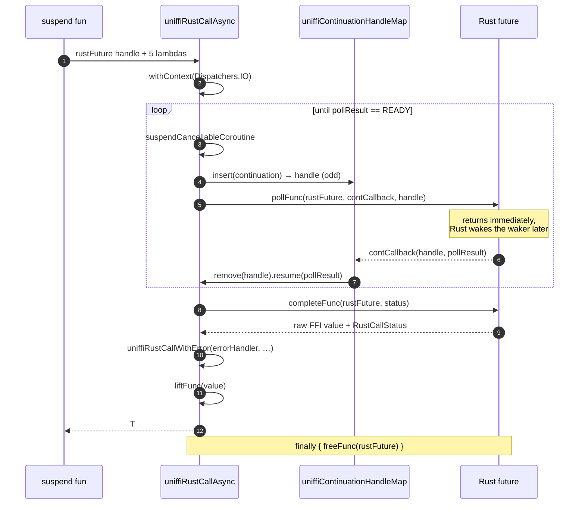
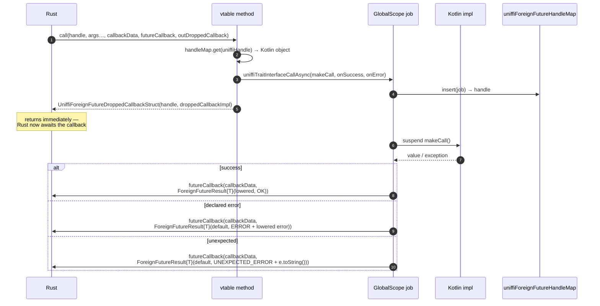

# Async

Async crosses the FFI in both directions:

- **Rust → Kotlin**: an `async fn` in Rust becomes a `suspend fun` in Kotlin, driven by a poll
  loop over a *Rust future handle*.
- **Kotlin → Rust**: an `async` method on a callback/trait interface implemented in Kotlin is
  exposed to Rust as a *foreign future* — Rust hands in a completion callback and gets back a
  drop handle.

Both use `kotlinx.coroutines`, which the plugin adds to `commonMain` automatically
(`addDependencies`, `Constants.COROUTINES_VERSION`).

## 1. Rust future → `suspend fun`

### What is generated

`macros.kt`'s `func_decl_with_body` emits a `suspend fun` when `callable.is_async()` and
delegates to the `call_async` macro, which builds one call to `uniffiRustCallAsync` with five
lambdas pre-bound by askama filters (`async_poll`, `async_complete`, `async_free`, `async_cancel`
in `mod::filters`):

```kotlin
@Suppress("ASSIGNED_BUT_NEVER_ACCESSED_VARIABLE")
@Throws(FooException::class, kotlin.coroutines.cancellation.CancellationException::class)
actual override suspend fun `bar`(x: String): Int {
    return uniffiRustCallAsync(
        callWithHandle { thisHandle ->
            UniffiLib.INSTANCE.uniffi_…_method_foo_bar(thisHandle, FfiConverterString.lower(x))!!
        },
        { future, callback, continuation -> UniffiLib.INSTANCE.ffi_…_rust_future_poll_i32(future, callback, continuation)!! },
        { future, continuation             -> UniffiLib.INSTANCE.ffi_…_rust_future_complete_i32(future, continuation) },
        { future                           -> UniffiLib.INSTANCE.ffi_…_rust_future_free_i32(future) },
        { future                           -> UniffiLib.INSTANCE.ffi_…_rust_future_cancel_i32(future) },
        { FfiConverterInt.lift(it!!) },
        FooExceptionErrorHandler,   // or UniffiNullRustCallStatusErrorHandler
    )
}
```

Note the receiver: for a method, the FFI call that *creates* the future is itself wrapped in
`callWithHandle`, so the object cannot be destroyed between the call and the future's creation.
The future handle it returns is a plain `Long` and is not tied to the object afterwards.

### The poll loop

`uniffiRustCallAsync` lives in the runtime
(`runtime/src/{jvmMain,androidMain,nativeMain}/kotlin/uniffi/runtime/Async.kt`) and, in identical
form, in `templates/generic/ffi/Async.kt` for the generated copy.



Details that matter:

- **`Dispatchers.IO`.** The whole call is wrapped in `withContext(Dispatchers.IO)`. `completeFunc`
  is a *blocking* FFI call, so it must not run on a UI dispatcher.
- **Poll results.** `UNIFFI_RUST_FUTURE_POLL_READY = 0`, `UNIFFI_RUST_FUTURE_POLL_MAYBE_READY = 1`.
  The loop repeats while the result is not `READY` — a spurious wake just polls again.
- **The continuation is handed to Rust as a handle, not a pointer.** Rust stores the `Long` and
  passes it back to the continuation callback; the callback looks it up, `remove`s it and
  `resume`s. One insert per poll iteration, one remove per wake.
- **`freeFunc` is in a `finally`.** The future handle is released on success, on error and on
  cancellation.

### Cancellation

```kotlin
continuation.invokeOnCancellation { cancelFunc(rustFuture) }
```

Cancelling the Kotlin coroutine calls `ffi_…_rust_future_cancel`, which makes Rust drop the
future. The `finally` still runs `freeFunc`. Every generated async callable is annotated
`@Throws(…, kotlin.coroutines.cancellation.CancellationException::class)` when it also throws a
declared error, so Java callers see the clause.

Note the continuation entry for a poll that is cancelled before it wakes stays in
`uniffiContinuationHandleMap` — the handle is only removed by the continuation callback.

### The continuation callback, per platform

This is the one piece that cannot be shared, because a C function pointer is expressed
differently on each platform:

| Platform | `UniffiRustFutureContinuationCallbackCallback` |
| --- | --- |
| JVM / Android | `object : UniffiRustFutureContinuationCallback` — a `com.sun.jna.Callback` with a `callback(handle, pollResult)` method |
| Native | `staticCFunction { handle: Long, pollResult: Byte -> … }` |

`staticCFunction` requires a non-capturing lambda, which is exactly why the continuation is
reached through a global handle map instead of being captured.

## 2. Kotlin async method → foreign future

The reverse direction: a trait or callback interface method declared `async` in Rust and
implemented in Kotlin.

Generated in `templates/generic/{android+jvm,native}/CallbackInterfaceImpl.kt`, with the helpers
in `templates/generic/ffi/Async.kt` (emitted only when
`ci.has_async_callback_interface_definition()`).



If Rust drops its future first, it invokes the dropped-callback:

```kotlin
// jvm
object UniffiForeignFutureDroppedCallbackImpl : UniffiForeignFutureDroppedCallback {
    override fun callback(handle: Long) {
        val job = uniffiForeignFutureHandleMap.remove(handle)
        if (!job.isCompleted) job.cancel()
    }
}
// native: the same body inside staticCFunction { handle: Long -> … }
```

### Why `GlobalScope`

The comment in the templates is the rationale, and it is worth keeping:

> Using `GlobalScope` is labeled as a "delicate API" and generally discouraged in Kotlin programs,
> since it breaks structured concurrency. However, our parent task is a Rust future, so we're
> going to need to break structured concurrency in any case. […] If the Rust future is dropped,
> `UniffiForeignFutureDroppedCallbackImpl` is called, which will cancel the Kotlin coroutine if
> it's still running.

So the structure is maintained across the FFI by the dropped-callback rather than by a Kotlin
parent scope.

### The naming, post-0.29/0.30

These were renamed upstream; the names in the current tree are:

| Old | Current |
| --- | --- |
| `ForeignFutureFree` | `ForeignFutureDroppedCallback` |
| `ForeignFuture` | `ForeignFutureDroppedCallbackStruct` |
| `ForeignFutureStruct{T}` | `ForeignFutureResult{T}` |
| `ForeignFutureStructPointer` / `ForeignFutureCompletePointer` | **removed** — an object returned from an async fn travels as a handle, so there is no pointer-shaped result any more |

All of them are in `FFI_BUILTINS` (`bindgen/src/gen_kotlin_multiplatform/mod.rs`), meaning they
are emitted into `common.h` once rather than into each namespace header. Keeping that list in
sync with upstream renames is load-bearing — a name that falls off it collides as soon as two
namespaces share a cinterop module.

## 3. Imports

`common/Types.kt`, `android+jvm/Types.kt` and `native/Types.kt` each end with a block guarded by
`` that calls `self.add_import(...)` for `kotlin.coroutines.resume`,
`kotlinx.coroutines.{launch, suspendCancellableCoroutine, CancellableContinuation,
DelicateCoroutinesApi, Job, GlobalScope, withContext, IO, Dispatchers}`. Adding a coroutine API to
the async templates means adding it there too, in all three.

## 4. Where to look

| Concern | File |
| --- | --- |
| generated `suspend fun` body | `bindgen/src/templates/macros.kt` — `func_decl_with_body`, `call_async` |
| the five FFI lambdas | `bindgen/src/gen_kotlin_multiplatform/mod.rs` — `async_poll`, `async_complete`, `async_free`, `async_cancel` |
| poll loop, foreign-future helpers (generated copy) | `bindgen/src/templates/generic/ffi/Async.kt` |
| poll loop, foreign-future helpers (runtime copy) | `runtime/src/{jvmMain,androidMain,nativeMain}/kotlin/uniffi/runtime/Async.kt` |
| async vtable methods | `bindgen/src/templates/generic/{android+jvm,native}/CallbackInterfaceImpl.kt` |
| foreign-future struct shapes on Native | `runtime/src/nativeMain/kotlin/uniffi/runtime/Types.kt` |
| tests | `tests/uniffi/futures` |

`async_complete` has one extra job: if the future's return type lowers to a `RustBuffer` belonging
to *another* crate, the completed value is re-wrapped into that crate's `RustBuffer{Name}ByValue`
typealias. See [external-and-remote-types.md](external-and-remote-types.md).

## 5. Gotcha

`futures › testFutureWithLockButNotCancelled` is timing-sensitive because JUnit schedules it
first in its class, so it used to absorb the one-time start-up of the `async_runtime = "tokio"`
exports. `@BeforeTest fun fireUpUniffi()` now calls `sayAfterWithTokio(0u, "warmup")` to pay that
cost outside the measurement (commit `cf1d314`). If another timing test in that class starts
failing, check whether it has become the first test and whether the warm-up still covers what it
uses.
