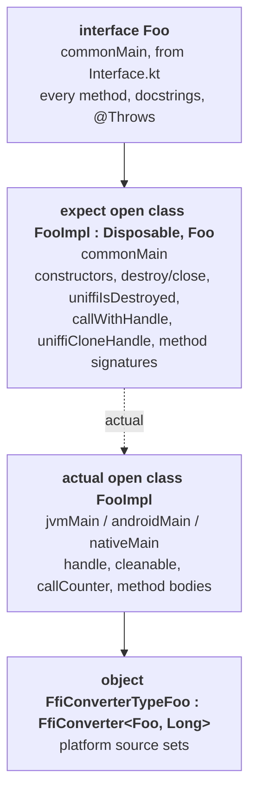
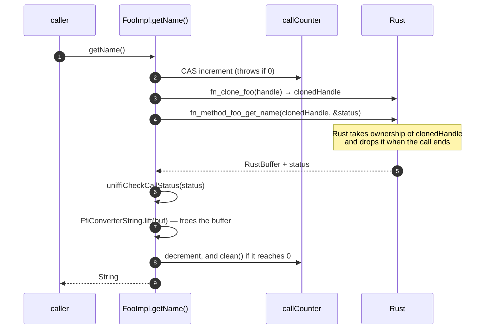
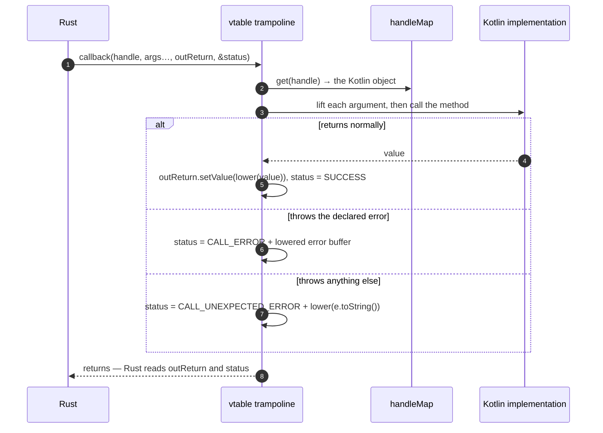
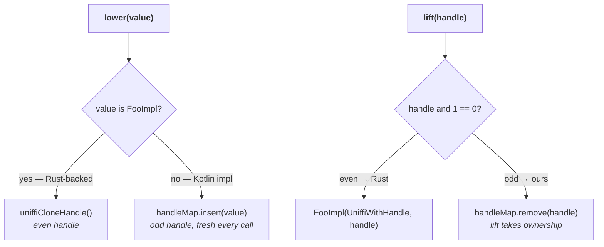
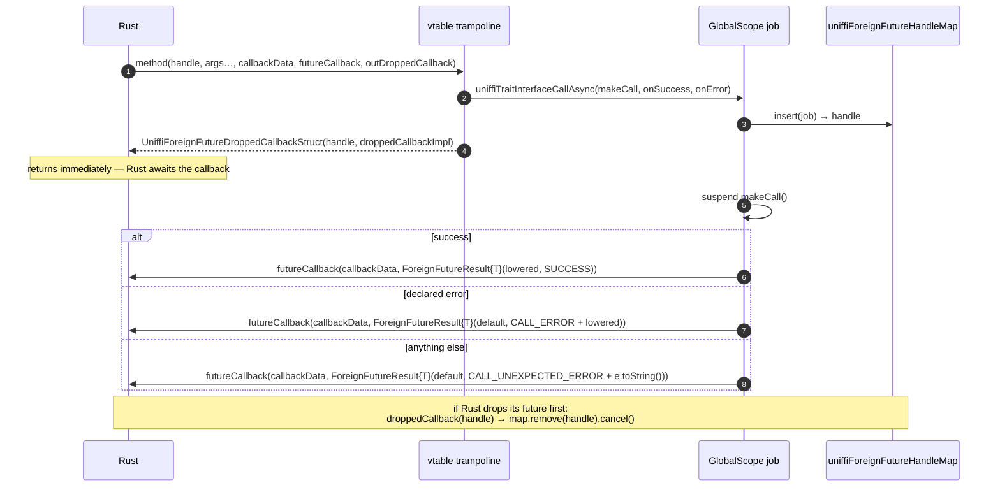
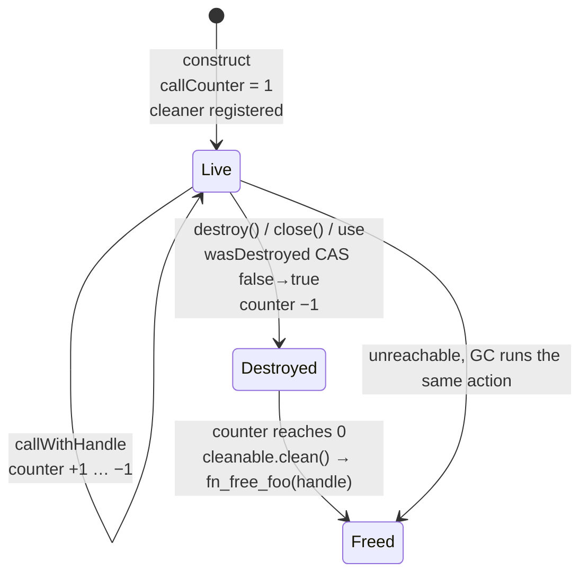
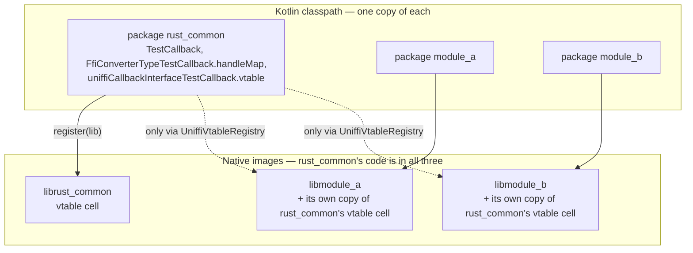
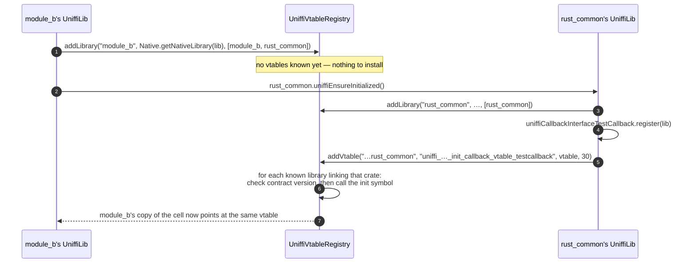

# Deep dive: objects, async, callbacks, lifetimes and modules

This document is for someone who already understands how a *value* crosses the boundary — a
primitive, a record, an enum — and wants the rest of the machinery: objects and their methods,
`async`, callbacks in the Rust → Kotlin direction, who frees what, and what actually makes a
multi-module build work.

It is written against `feature/uniffi-0.32.0-update` (uniffi 0.32.0) and is self-contained, but
deliberately does not re-derive what the focused documents already cover in depth. Where a
mechanism has its own document, this one explains the shape and links to it:

- [architecture.md](architecture.md) — the pipeline, templates, `FfiConverter`, the source-set split
- [handles.md](handles.md) — the handle representation and the low-bit tag, in detail
- [async.md](async.md) — the poll loop and foreign futures, in detail
- [external-and-remote-types.md](external-and-remote-types.md) — cross-crate type resolution, in detail

## Abbreviations used here

| Short | Written out |
| --- | --- |
| FFI | Foreign Function Interface — the `extern "C"` surface between Rust and Kotlin |
| ABI | Application Binary Interface — the in-memory layout and calling convention both sides must agree on |
| KMP | Kotlin Multiplatform |
| JVM | Java Virtual Machine |
| JNA | Java Native Access — the library the JVM and Android source sets use to call C functions |
| UDL | UniFFI Definition Language — the `.udl` interface file, the alternative to proc-macros |
| GC | garbage collector |
| vtable | virtual function table — here, a C struct of function pointers Rust calls back through |
| CAS | compare-and-set — the atomic primitive the call counter uses |
| API | application programming interface |
| cdylib / staticlib | Cargo crate types: a C-compatible shared library / a static archive |
| SIGABRT | the POSIX abort signal — how a Rust panic inside a destructor ends the process |
| CI | continuous integration (the GitHub Actions workflows) |

`ComponentInterface` is uniffi's parsed model of one crate's exported API. It is spelled out
everywhere below rather than abbreviated, because uniffi's own sources shorten it to `ci` and this
document also talks about continuous integration.

## 0. Three rules that explain most of the rest

Everything in this document follows from three conventions. They are worth internalising before
reading further, because every lifetime bug is a violation of one of them.

1. **`lower()` transfers ownership to the callee.** After a value is lowered, whoever receives it
   is responsible for it. That is why lowering an object *clones* the handle rather than handing
   over the one the Kotlin instance holds, and why lowering a Kotlin callback implementation
   *inserts a fresh entry* into a handle map on every call.
2. **`lift()` takes ownership from the caller.** After lifting, the receiving side must free the
   thing eventually. That is why lifting a `RustBuffer` frees it, and why lifting a foreign handle
   `remove`s it from the handle map instead of `get`ting it.
3. **Anything that cannot be expressed as an owned value gets a handle, and handles are `Long`.**
   Objects, callback implementations, Rust futures and coroutine continuations all cross as 64-bit
   integers. Rust-side handles are derived from an `Arc` pointer and are therefore always even;
   foreign handles come from `UniffiHandleMap`, which starts at 1 and steps by 2, so they are
   always odd. That one-bit difference is the entire discriminator for bidirectional types.

## 1. Objects and methods

### 1.1 What Rust exports

For an exported object `TestObject` in crate `uniffi_kmm_fixture_multi_rust_common`, the
scaffolding exports these C symbols (real names, from the `multi-module` fixture):

```
uniffi_uniffi_kmm_fixture_multi_rust_common_fn_constructor_testobject_new(RustBuffer, RustCallStatus*) -> uint64_t
uniffi_uniffi_kmm_fixture_multi_rust_common_fn_clone_testobject(uint64_t, RustCallStatus*)  -> uint64_t
uniffi_uniffi_kmm_fixture_multi_rust_common_fn_free_testobject(uint64_t, RustCallStatus*)
uniffi_uniffi_kmm_fixture_multi_rust_common_fn_method_testobject_get_name(uint64_t, RustCallStatus*) -> RustBuffer
```

So an object is: an integer handle, a clone function, a free function, and one flat function per
method taking the handle as its first argument. There is no vtable and no C++-style object model.
`Object::ffi_object_clone()` and `ffi_object_free()` on the `ComponentInterface` are where the
generator gets those two names; the method symbols come from `Callable::ffi_func()`.

### 1.2 What the bindgen generates

`KotlinCodeOracle::object_names()` decides the two names, and the choice matters:

| Rust shape | Kotlin interface | Kotlin class |
| --- | --- | --- |
| plain `#[derive(uniffi::Object)]` | `FooInterface` | `Foo` |
| trait interface with a foreign implementation (`has_callback_interface()`) | `Foo` | `FooImpl` |

The plain case gives the *class* the nice name, because nobody will implement it in Kotlin. The
trait-interface case gives the *interface* the nice name, because users write
`class MyThing : Foo { … }` and pass that to Rust.

Three declarations come out of `generic/common/ObjectTemplate.kt` and
`generic/ffi/ObjectTemplate.kt`:



Objects are `expect`/`actual` classes rather than plain common classes because their method bodies
must reach `UniffiLib`, which only exists per platform (JNA on JVM/Android, cinterop on Native).
Records and enums are declared once in `commonMain` — see [§1.7](#17-methods-on-records-and-enums)
for how *their* methods get around the same problem.

The three constructors:

```kotlin
constructor(uniffiWithHandle: UniffiWithHandle, handle: Long)  // wrap a handle from Rust
constructor(noHandle: NoHandle)                                // fake for tests, handle = null
constructor(<user args>)                                       // the Rust primary constructor
```

`UniffiWithHandle` exists only so the internal constructor cannot collide with a user-defined
constructor taking a single `Long` — since 0.30 a handle *is* a `Long`, so a marker parameter is
the only thing keeping the two apart. Both markers, plus `Disposable` and `use`, are declared in
the generated `common/Types.kt` rather than imported from `uniffi.runtime`: `Disposable` is a
supertype of every generated object, so taking it from the runtime would drag the runtime into the
binding's public API surface.

An *async* primary constructor produces no constructor at all — the template emits
`// Note no constructor generated for this object as it is async.` Alternate constructors become
functions on the `companion object`, and an async one is fine there because it can be a `suspend
fun`.

### 1.3 A method call, end to end

`macros.kt`'s `func_decl_with_body` → `to_ffi_call` → `to_raw_ffi_call` produce this:

```kotlin
actual override fun `getName`(): kotlin.String {
    return FfiConverterString.lift(
        callWithHandle {
            uniffiRustCall() { _status ->
                UniffiLib.INSTANCE.uniffi_…_fn_method_testobject_get_name(it, _status)!!
            }
        }
    )
}
```



Two things to hold on to:

- **The block receives a clone, not the stored handle.** Rule 1 from §0: the callee owns what it is
  given, and drops it. Without the clone, one method call would free the object.
- **`callWithHandle` is what makes `destroy()` safe.** The counter starts at 1 (meaning "not yet
  destroyed"); each in-flight call adds one. Whichever decrement reaches zero — the last call
  returning, or `destroy()` itself — runs the cleaner action.

Errors ride the `RustCallStatus` out-parameter, not the return value. `to_raw_ffi_call` picks
`uniffiRustCall()` when `throws_type()` is `None` and `uniffiRustCallWithError({Error}ErrorHandler)`
otherwise; `uniffiCheckCallStatus` then throws the lifted error for `CALL_ERROR`, or an
`InternalException` carrying the panic message for `CALL_UNEXPECTED_ERROR`.

### 1.4 The converter

```kotlin
public object FfiConverterTypeFoo : FfiConverter<Foo, Long> {
    override fun lower(value: Foo): Long = (value as FooImpl).uniffiCloneHandle()
    override fun lift(value: Long): Foo  = FooImpl(UniffiWithHandle, value)
    override fun read(buf: ByteBuffer)   = lift(buf.getLong())
    override fun allocationSize(value: Foo) = 8UL
    override fun write(value: Foo, buf: ByteBuffer) { buf.putLong(lower(value)) }
}
```

Handles are always 8 bytes inside a `RustBuffer` — the Rust side writes them that way and fails to
compile if they do not fit. For a trait interface the `lower`/`lift` bodies branch on the low-bit
tag; that is [§3.4](#34-bidirectional-trait-interfaces) and [handles.md](handles.md).

### 1.5 uniffi traits on objects

`obj.uniffi_trait_methods()` carries the Rust traits uniffi knows how to project:

| Rust | Kotlin |
| --- | --- |
| `Display`, else `Debug` | `override fun toString(): String` |
| `Eq` (only `eq` is used) | `override fun equals(other: Any?): Boolean` |
| `Hash` | `override fun hashCode(): Int` |
| `Ord` | `override fun compareTo(other: FooImpl): Int`, and the class implements `Comparable` |

Each is an ordinary FFI call under the hood — `uniffi_…_fn_method_foo_uniffi_trait_display` and
friends — lifted and, for `hashCode`/`compareTo`, narrowed with `.toInt()`.

### 1.6 Objects used as errors

If `ci.is_name_used_as_error(name)` is true, the class additionally extends `kotlin.Exception` and
an `{Impl}ErrorHandler` object is emitted next to it, which lifts the error out of the status's
`RustBuffer` by calling the converter's `read`. That is the same shape enum errors use; the only
oddity is the "companion object confusion" comment in the template — an object that is both an
error and has alternate constructors puts both on the same companion.

### 1.7 Methods on records and enums

Since uniffi 0.31 a record or enum can carry methods too. Their receiver is *not* a handle: `self`
is lowered into a `RustBuffer` like any other value, so there is nothing to keep alive and
`callWithHandle` does not apply. `to_ffi_call` therefore branches on the receiver being
`Some(Type::Object { .. })` specifically, not merely on there being a receiver.

The harder problem is Kotlin-side. A record is a `data class` declared once in `commonMain` — it
cannot be `expect`, or it would lose `copy` and `componentN` — and `commonMain` has no `UniffiLib`.
The solution (all of it in `macros.kt`, under the "Methods and uniffi trait exports on records and
enums" banner) is to split every such method in two:

```kotlin
// commonMain, on the data class — an ordinary member function
fun `shout`(): kotlin.String =
    uniffiSelfCall_uniffi_…_fn_method_traitmethodsrecord_shout(this)

// commonMain, top level
internal expect fun uniffiSelfCall_uniffi_…_fn_method_traitmethodsrecord_shout(
    uniffiSelf: TraitMethodsRecord,
): kotlin.String

// jvmMain / androidMain / nativeMain, next to the record's FfiConverter
internal actual fun uniffiSelfCall_uniffi_…_shout(uniffiSelf: TraitMethodsRecord): kotlin.String =
    FfiConverterString.lift(uniffiRustCall { _status ->
        UniffiLib.INSTANCE.uniffi_…_shout(FfiConverterTypeTraitMethodsRecord.lower(uniffiSelf), _status)!!
    })
```

Details worth knowing:

- The shim is named after the **FFI symbol** it wraps (`uniffiSelfCall_{symbol}`), which is already
  unique across the library, so two types' identically-named methods cannot collide.
- The receiver parameter is always called `uniffiSelf` — that is the name `to_raw_ffi_call` lowers
  for a non-object receiver.
- `toString`/`equals`/`hashCode`/`compareTo` stay real overrides on the type and delegate to shims,
  so they work through `Any`.
- For a Kotlin `enum class` (a "flat" enum) `equals`, `hashCode` and `compareTo` are final on
  `kotlin.Enum` and cannot be overridden, so those three are dropped. Kotlin's identity equality and
  ordinal ordering agree with a fieldless Rust enum's derives — except for explicit out-of-order
  discriminants, where `#[derive(Ord)]` compares by value and Kotlin compares by ordinal.

Fixture: `tests/uniffi/trait-methods`.

## 2. Async

Full treatment in [async.md](async.md). The shape, and the parts that interact with objects and
cleanup:

### 2.1 Rust `async fn` → Kotlin `suspend fun`

An async callable does not return a value; it returns a **future handle** (`Long`). Kotlin then
drives it with four more FFI functions, chosen by return type
(`ffi_{ns}_rust_future_{poll,complete,free,cancel}_{i32,rust_buffer,…}`), all funnelled through one
runtime helper:

```kotlin
uniffiRustCallAsync(
    /* rustFuture   */ callWithHandle { h -> UniffiLib.INSTANCE.uniffi_…_method_foo_bar(h, lowered)!! },
    /* pollFunc     */ { future, callback, continuation -> … },
    /* completeFunc */ { future, continuation -> … },
    /* freeFunc     */ { future -> … },
    /* cancelFunc   */ { future -> … },
    /* liftFunc     */ { FfiConverterInt.lift(it!!) },
    /* errorHandler */ FooExceptionErrorHandler,
)
```

The loop: `withContext(Dispatchers.IO)`, then repeatedly `suspendCancellableCoroutine` →
insert the continuation into `uniffiContinuationHandleMap` → `pollFunc(future, callback, handle)`
→ Rust calls the callback with that handle when the waker fires → the callback `remove`s and
`resume`s. When the poll result is `READY`, `completeFunc` produces the raw value plus a
`RustCallStatus`, which goes through the normal error check and then `liftFunc`.

Interactions worth noting:

- **The future's lifetime is independent of the object's.** `callWithHandle` wraps only the call
  that *creates* the future; once it returns, the object's call counter has already been
  decremented. The Rust future holds its own clone of the object handle.
- **`freeFunc` is in a `finally`** — success, error and cancellation all release the future.
- **Cancellation** is `continuation.invokeOnCancellation { cancelFunc(rustFuture) }`, which makes
  Rust drop the future; the `finally` still frees it.
- **The continuation is reached through a handle map, not a captured reference**, because
  Kotlin/Native's `staticCFunction` only accepts a non-capturing lambda.
- **`Dispatchers.IO`** because `completeFunc` blocks.
- Borrowed bytes (`&[u8]`) are rejected in async position by `reject_async_borrowed_bytes` — the
  borrow would end when the call returns the future handle, while Rust is still reading.

### 2.2 Kotlin `suspend` → Rust foreign future

The reverse direction exists only on callback and trait interfaces, and is covered in
[§3.5](#35-async-callback-methods).

## 3. Callbacks

"Callback" covers two Rust-side declarations that generate almost the same Kotlin. Keeping them
apart matters, because their converters differ in exactly one respect: ownership on `lift`.

| Rust declaration | `ComponentInterface` shape | Kotlin | Direction |
| --- | --- | --- | --- |
| `callback interface Foo { … };` (UDL) or `#[uniffi::export(callback_interface)]` | `Type::CallbackInterface` | `interface Foo` only — no class | Kotlin implements, Rust calls |
| `#[uniffi::export(with_foreign)] trait Foo` / `[Trait, WithForeign]` | `Type::Object` with `has_callback_interface() == true` | `interface Foo` **and** `class FooImpl` | either side implements |
| `#[uniffi::export] trait Foo` / `[Trait]` | `Type::Object`, `Trait(RustOnly)` | `interface FooInterface` + `class Foo` | Rust implements only — an ordinary object |

The first two are what this section is about. The third is just §1.

### 3.1 The generated vtable holder

Both flavours include `CallbackInterfaceImpl.kt`, which emits one object per interface:

```kotlin
internal object uniffiCallbackInterfaceTestCallback {
    internal object `callback` : UniffiCallbackInterfaceTestCallbackMethod0 { … }   // one per method
    internal object uniffiFree  : UniffiCallbackInterfaceFree  { … }
    internal object uniffiClone : UniffiCallbackInterfaceClone { … }

    internal val vtable = UniffiVTableCallbackInterfaceTestCallback(
        uniffiFree,
        uniffiClone,
        `callback`,
    )

    internal fun register(lib: UniffiLib) {
        lib.uniffi_…_fn_init_callback_vtable_testcallback(vtable)
    }
}
```

> **Field order is part of the ABI.** uniffi 0.30 moved `free` from last to first and inserted
> `clone` right after it, ahead of the interface methods. A binding generated by an older bindgen
> against 0.32 scaffolding does not fail to load — it crashes, because Rust calls `free` where the
> vtable has a method.

### 3.2 What one trampoline does

```kotlin
override fun callback(uniffiHandle: Long, uniffiOutReturn: RustBufferByValue,
                      uniffiCallStatus: UniffiRustCallStatus) {
    val uniffiObj = FfiConverterTypeTestCallback.handleMap.get(uniffiHandle)
    val makeCall = { -> uniffiObj.`callback`() }
    val writeReturn = { value: kotlin.String -> uniffiOutReturn.setValue(FfiConverterString.lower(value)) }
    uniffiTraitInterfaceCall(uniffiCallStatus, makeCall, writeReturn)
}
```



The unexpected-error path is why a Rust trait used with `callback_interface` needs
`impl From<uniffi::UnexpectedUniFFICallbackError> for YourError` — Rust turns
`CALL_UNEXPECTED_ERROR` back into that type. `tests/uniffi/callbacks` exercises both paths.

Return values and errors always leave through **out-parameters**, never through the C return value —
the trampoline's own return type is `Unit`. The out-parameter is typed by the FFI callback
signature, so it is by-reference for a scalar and a `RustBuffer` for everything else:

```kotlin
fun callback(uniffiHandle: Long, v: Byte, argumentTwo: Byte,
             uniffiOutReturn: ByteByReference, uniffiCallStatus: UniffiRustCallStatus)
// …
val writeReturn = { value: kotlin.Boolean -> uniffiOutReturn.setValue(FfiConverterBoolean.lower(value)) }
```

The error, by contrast, is always a `RustBuffer` hanging off `UniffiRustCallStatus`. (The comment on
`FfiConverter.lowerIntoRustBuffer` claiming that *callback returns* are always serialised into a
`RustBuffer` is inherited from upstream and no longer describes 0.32 — as the `ByteByReference`
above shows. That helper is what `FfiConverterRustBuffer.lower` and error lowering use.)

### 3.3 Registration

`CodeType::initialization_fn()` (`gen_kotlin_multiplatform/{object,callback_interface}.rs`) returns
`uniffiCallbackInterface{Name}.register` for anything with a foreign implementation.
`KotlinWrapper::initialization_fns()` collects those, and the `UniffiLib.INSTANCE` initialiser calls
them the first time anything in the namespace is touched:

```kotlin
internal val INSTANCE: UniffiLib by lazy {
    loadIndirect<UniffiLib>(componentName = "module_a").also { lib ->
        uniffiCheckContractApiVersion(lib)
        uniffiCheckApiChecksums(lib)
        uniffi.runtime.UniffiVtableRegistry.addLibrary(…)        // JVM/Android only — see §7
        uniffiCallbackInterfaceModACallback.register(lib)         // our own vtables
        rust_common.uniffiEnsureInitialized()                     // external crates' vtables
        uniffi.runtime.UniffiVtableRegistry.addVtable(…)          // JVM/Android only — see §7
    }
}
```

The `uniffiEnsureInitialized()` line is the fix for [uniffi #2343](https://github.com/mozilla/uniffi-rs/issues/2343):
`initialization_fns()` walks `iter_external_types()` as well as `iter_local_types()`, so touching
this namespace forces every crate it uses to register its vtables too. Without it, Rust could reach
an unset vtable — which aborts the process rather than throwing, because the failing handle panics
a second time while unwinding.

On Kotlin/Native the vtable is `nativeHeap.alloc<cinterop.UniffiVTable…> { … }.ptr` with each entry
a `staticCFunction`, and it is never freed: it is registered for the life of the process by design.
On JVM/Android the entries are `internal object`s implementing `com.sun.jna.Callback`, which are
JVM singletons and therefore never collected — this matters, since JNA does not keep a strong
reference to a callback for you.

### 3.4 Bidirectional trait interfaces

A `with_foreign` trait can be implemented on either side, so a handle arriving from Rust may be a
Rust object or one of ours coming home. The low-bit tag decides:



A plain `callback interface` needs none of that: it can only ever be implemented in Kotlin, so its
converter is the runtime's `FfiConverterCallbackInterface<T>`, where `lower` is `handleMap.insert`
and `lift` is `handleMap.get`. Note the asymmetry with the trait-interface `lift`: a callback
interface handle handed back to Kotlin is still owned by Rust, which will free it through the
vtable, so `get` (borrow) is correct there and `remove` would be a use-after-free. On the trait
side, `lift` is the end of Rust's ownership, so `remove` is correct and `get` would leak.

**Every `lower` mints a fresh handle.** Passing the same Kotlin object to two different functions
creates two independent entries pointing at the same object; each receiver frees its own. This is
what makes the multi-module case work at all (§7).

### 3.5 Async callback methods

An `async` method on a callback or trait interface cannot block the calling Rust thread, so it
returns immediately and hands Rust a **foreign future**: Rust supplies a completion callback plus
opaque callback data, and gets back a struct holding a handle and a dropped-callback.



`GlobalScope` is deliberate, and the template says why: the parent task is a Rust future, so
structured concurrency is already broken by the FFI. The structure is restored across the boundary
by the dropped-callback, which cancels the Kotlin job when Rust drops the future.

The helpers are `uniffiTraitInterfaceCallAsync` / `…WithError` in
`runtime/src/{jvm,android,native}Main/…/Async.kt`, mirrored in `templates/generic/ffi/Async.kt` and
emitted only when `ci.has_async_callback_interface_definition()`.

## 4. Cleanup: who frees what

This is the section to re-read when something leaks or double-frees. Kotlin has no destructors, so
every Rust-side allocation reachable from Kotlin has an explicit release path, and most have a
GC-driven backstop.

### 4.1 Objects



```kotlin
protected val handle: Long?
protected val cleanable: UniffiCleaner.Cleanable
private val wasDestroyed = kotlinx.atomicfu.atomic(false)
private val callCounter  = kotlinx.atomicfu.atomic(1L)      // the 1 is "not yet destroyed"
actual val uniffiIsDestroyed: Boolean get() = wasDestroyed.value
```

- `destroy()` is idempotent by CAS; `close()` is `destroy()` under a `ReentrantLock`; `use { }` in
  the generated `common/Types.kt` calls `destroy()` in a `finally` and swallows throwables from it.
- The cleaner action is a **static inner class** `UniffiCleanAction(handle)`, not a lambda — a
  lambda would capture `this`, the object would never become unreachable, and the GC backstop would
  never fire.
- The atomics are **atomicfu** (`.value`, `.compareAndSet`), not `java.util.concurrent.atomic`,
  because the code is shared with Kotlin/Native.

Cleaner implementations, all in `runtime/src/*/kotlin/uniffi/runtime/ObjectCleanerHelper.kt`:

| Platform | Backing |
| --- | --- |
| JVM | `java.lang.ref.Cleaner`, falling back to `com.sun.jna.internal.Cleaner` on `ClassNotFoundException` |
| Android | `android.system.SystemCleaner` from API level 34, else the JNA cleaner |
| Native | `kotlin.native.ref.createCleaner`, wrapped in `OnceRunnable` (an atomic `didRun`) so an explicit `clean()` followed by GC does not double-free |

The cleaner itself is one lazy singleton per library, `UniffiLib.CLEANER`, emitted only when
`ci.contains_object_types()`.

Records and enums that *contain* objects also implement `Disposable`; `Disposable.destroy(vararg)`
filters its arguments for `Disposable` and destroys them, which is how `destroy()` recurses into a
record's fields.

### 4.2 Callback implementations

A Kotlin object handed to Rust is kept alive by the strong reference in `UniffiHandleMap`, and
released when Rust calls the vtable's `free` entry:

| Event | What happens |
| --- | --- |
| `lower(kotlinImpl)` | `handleMap.insert` — new odd handle, strong reference held |
| Rust clones the trait object | vtable `clone` → `handleMap.clone(handle)` → a second handle to the same object |
| Rust drops it | vtable `free` → `handleMap.remove(handle)` |
| Rust hands it back to Kotlin (trait interface) | `lift` → `handleMap.remove(handle)`; ownership ends |
| Rust hands back a plain callback-interface handle | `lift` → `handleMap.get(handle)`; Rust still owns it |

Forgetting the `remove` on the lift path is a leak; using `remove` where Rust retains ownership is a
use-after-free. Both are invisible until the map grows or a later call throws
`InternalException("UniffiHandleMap: Invalid handle")`.

### 4.3 Buffers

`RustBuffer` is allocated by Rust and freed by Rust; Kotlin only ever borrows the memory through a
`ByteBuffer` view.

- `lowerIntoRustBuffer` allocates through `RustBufferHelper.allocValue(allocationSize(value))`,
  writes, and hands ownership to Rust.
- `liftFromRustBuffer` reads, checks that nothing is left over, and frees in a `finally` — so
  lifting is what releases the buffer, including on the error path.
- An error buffer that is *not* lifted still has to go: `UniffiNullRustCallStatusErrorHandler.lift`
  frees it before throwing `InternalException("Unexpected CALL_ERROR")`.
- `ForeignBytes` (`&[u8]`) is the opposite direction — Kotlin's buffer, borrowed by Rust for the
  duration of one call. `withForeignBytes` pins the array (`usePinned` on Native) or copies it into
  `com.sun.jna.Memory` (JVM/Android) and releases on the way out; an empty array goes over as
  `(null, 0)`. Because it is a *scope*, `to_raw_ffi_call` wraps the whole call rather than lowering
  an expression. See architecture.md §6.

### 4.4 Async

| Thing | Freed by |
| --- | --- |
| Rust future handle | `freeFunc(rustFuture)` in the `finally` of `uniffiRustCallAsync` |
| Continuation entry in `uniffiContinuationHandleMap` | the continuation callback, which `remove`s before resuming |
| Kotlin `Job` in `uniffiForeignFutureHandleMap` | the dropped-callback, which `remove`s and cancels |

One known wart: if a coroutine is cancelled between `insert` and the wake, the continuation entry is
never removed — the map only sheds entries via the callback. It is bounded by outstanding polls, not
unbounded, but it is not zero.

### 4.5 Things that are deliberately never freed

- The Kotlin/Native vtable (`nativeHeap.alloc(…).ptr`) — registered for the process lifetime.
- JNA callback singletons — must outlive every Rust-side reference.
- `UniffiLib.INSTANCE`, `CLEANER`, and the entries of `UniffiVtableRegistry`.

### 4.6 Failure-mode cheat sheet

| Symptom | Usual cause |
| --- | --- |
| `IllegalStateException: … object has already been destroyed` | a call after `destroy()`/`use { }`, or a leaked reference out of a `use` block |
| `InternalException("UniffiHandleMap: Invalid handle")` | double free, or a `remove` where `get` was correct |
| SIGABRT / exit 134, no exception | Rust called through an unregistered vtable — §3.3 and §7 |
| `RuntimeException: UniFFI API checksum mismatch` | stale bindgen or stale generated sources; let the plugin reinstall the bindgen |
| Native-only compile or crash after a struct change | JVM/Android declare JNA structs, Native reads the generated C header; the two drifted |

## 5. External types

Full detail in [external-and-remote-types.md](external-and-remote-types.md). The essentials:

- Since uniffi 0.29 there is no `Type::External`. A type from another crate is an ordinary
  `Type::Record`/`Enum`/`Object`, and externality is a *query*: `ci.is_external(ty)`,
  `ci.iter_local_types()`, `ci.iter_external_types()`.
- The crate → Kotlin package mapping comes from `config.external_packages`, keyed by **crate name**
  (`module_path` is a full path since 0.31, hence `.split("::").next()`).
  `KotlinBindingGenerator::update_component_configs` fills it in automatically across all components
  in one generation run; a `uniffi.toml` entry overrides it.
- `commonMain` emits only an `import` for an external type — the other crate's generated
  `commonMain` declares it. The platform source sets additionally import its `FfiConverter` and
  declare `typealias RustBuffer{Name}` / `…ByValue`, and the C header declares
  `typedef RustBuffer RustBuffer{Name};`, so the declarations line up with what cinterop sees.
- Never test "is this external" with `FfiType::RustBuffer(Some(_))`: 0.32 attaches external metadata
  to *every* record and enum. Compare crate names.

## 6. Remote types

A **remote type** is a type whose Rust definition lives in a crate that knows nothing about uniffi
(`url::Url`, `http::HeaderMap`, `std` types). All of the work is on the Rust side; by the time the
bindgen sees one it is an ordinary record, enum, object or custom type, and **no generator support
is involved**. If a remote type is not working, the missing piece is in the Rust source:

```rust
uniffi::use_remote_type!(other_uniffi_crate::Url);          // reuse another uniffi crate's definition

uniffi::custom_type!(HeaderMap, Vec<HttpHeader>, {          // describe a foreign crate's type
    remote,                                                  // required: not our crate
    lower: |obj| { … },
    try_lift: |val| { … },
});
```

```webidl
[Remote] dictionary ExternalCrateDictionary { string sval; };   // or describe it structurally in UDL
[Remote] interface ExternalCrateInterface { string value(); };
```

Migrating from 0.28: `use_udl_record!`, `use_udl_enum!`, `use_udl_object!` and
`ffi_converter_forward!` are gone; `use_remote_type!` replaces them, and a third-party type
described in your own UDL needs `[Remote]`.

Custom types are the adjacent concept — a newtype that travels as a builtin, optionally mapped to a
different Kotlin type via `[custom_types.X]` (`type_name`, `imports`, `lift`/`into_custom`,
`lower`/`from_custom`). Both are covered in
[external-and-remote-types.md](external-and-remote-types.md) §2–3.

## 7. Multi-module

"Multi-module" here means: several Gradle modules, each with its own Rust crate and its own uniffi
bindings, where one module's Rust depends on another's and one module's Kotlin uses the other's
generated types. `tests/uniffi/multi-module` is the reference shape:

```
rust-common  ── crate uniffi_kmm_fixture_multi_rust_common, namespace rust_common
   │                TestRecord, TestObject, #[uniffi::export(with_foreign)] trait TestCallback
   ├── mod-a  ── depends on rust-common (Cargo + Gradle), namespace module_a
   ├── mod-b  ── depends on rust-common (Cargo + Gradle), namespace module_b
   └── combined ── no Rust, no uniffi plugin; depends on all three. The shape a real app has.
```

### 7.1 What you have to do

**Rust side** — an ordinary path/registry dependency, and use the types directly:

```toml
[dependencies]
uniffi = { workspace = true }
uniffi-kmm-fixture-multi-rust-common = { path = "../rust-common" }
```

```rust
use uniffi_kmm_fixture_multi_rust_common::{TestCallback, TestObject, TestRecord};

#[uniffi::export]
pub fn greet(obj: &TestObject) -> String { … }

uniffi::setup_scaffolding!("module_a");
```

Note the crate types. The *leaf* crate needs `crate-type = ["lib", "cdylib", "staticlib"]` — `lib`
so other crates can depend on it at all; a consumer needs only `["cdylib", "staticlib"]` unless
something depends on it in turn.

**Gradle side** — each module applies the plugin and declares a normal project dependency:

```kotlin
uniffi {
    bindgenFromPath(rootProject.layout.projectDirectory.dir("bindgen"))
    generateFromLibrary { namespace = "module_a" }
}

kotlin.sourceSets.commonMain.dependencies {
    implementation(project(":tests:uniffi:multi-module:rust-common"))
}
```

Use `api(...)` instead of `implementation(...)` when the other module's types appear in your own
public signatures — which they usually do.

**Leave `generateBindingsForExternalCrates` at its default `false`.** It controls whether `--crate
<name>` is passed to the bindgen. False means each module generates only its own crate's Kotlin and
*imports* the rest. Setting it true makes a module regenerate its dependencies' bindings too, which
puts two copies of the same fully-qualified names on one classpath as soon as both modules are
present. It is only ever safe for a single leaf consumer.

**Kotlin/Native needs cinterop commonization** (`kotlin.mpp.enableCInteropCommonization=true`); the
plugin fails the build in `afterEvaluate` if it is missing.

### 7.2 What happens under the hood

The thing to understand — because every multi-module caveat follows from it — is that **each Gradle
module produces its own library and statically links its Rust dependencies into it**. There is no
shared `librust_common.so`. So:



Most things are unaffected by the duplication:

- **Records** are pure data, serialised into a `RustBuffer` on each crossing.
- **Objects** are `Arc` pointers — allocated by whichever image created them, freed through the
  same crate's free function, which every image has an identical copy of. `greet(TestObject(…))`
  across modules works.
- **Rust-implemented callbacks** dispatch through the trait object's own Rust vtable; the uniffi
  cell is never read.

Exactly one thing *is* affected: a `with_foreign` trait's foreign vtable. The declaring crate has a
`static UNIFFI_TRAIT_CELL_{NAME}: UniffiForeignPointerCell<…>`, duplicated once per linked image,
while the Kotlin package that owns the vtable exists once and can only call one image's init symbol.
Passing a Kotlin implementation into a *different* module's function then dispatched through a null
cell: Rust panics, panics again in the handle's `Drop` while unwinding, and a panic in a destructor
during cleanup aborts the process — SIGABRT, exit 134, not a catchable exception.

That framing — one cell per loaded shared library — is the JVM/Android one, and §7.3 fixes it.
Kotlin/Native links everything into a single image instead, where the copies normally *collapse*;
when they fail to, the cause is different and is covered in
[§7.4](#74-why-kotlinnative-breaks-the-cell-symbol).

### 7.3 The fix, on JVM and Android

The lever is that `uniffi.runtime` resolves **once** for a whole application, so it can host a true
singleton that knows every vtable and every loaded library and keeps the cross product installed:
`UniffiVtableRegistry` in `runtime/src/{jvmMain,androidMain}/kotlin/uniffi/runtime/CallbackInterfaceRuntime.kt`.



Both directions are covered: a vtable published later is pushed into libraries already registered, a
library loaded later receives every vtable seen so far. Three details are load-bearing:

- **`com.sun.jna.Native.getNativeLibrary(lib)`, never `NativeLibrary.getInstance(name)`.** They are
  different entries in JNA's cache. When the library sits on the classpath as a directory both
  resolve the same file and it appears to work; when it ships inside a jar each entry extracts and
  opens its **own copy**, and the vtable lands in an image nothing calls — registration returns
  cleanly and the call aborts anyway.
- **`linkedCrates` gates installation.** It comes from `linked_crates()`
  (`gen_kotlin_multiplatform/mod.rs`), which reads `ci.all_component_interfaces()` — exactly the set
  of crates the library was built from, matching `nm` on the produced library — and always folds in
  the namespace's own crate as a floor. A vtable whose crate is absent from a library is skipped:
  that library has neither a cell to fill nor the symbol to fill it with. This is the registry's only
  silent path.
- **Contract version is verified per library** before its cell is written, by calling
  `ffi_{crate}_uniffi_contract_version` in *that* image.

`register(lib)` is still emitted for the namespace's own library, so a missing symbol there fails
loudly and typed; the registry then re-installs the same pointer, which is an idempotent atomic
store.

The generator side is two methods on the `kotlin_wrapper!` macro — `linked_crates()` and
`callback_vtables()`, the latter walking `iter_local_types()` so it stays in step with the
`uniffiCallbackInterface*` objects `Types.kt` renders, and covering **both** definition lists (an
object with `has_callback_interface()` *and* a `callback_interface_definitions()` entry). Only
`generic/android+jvm/NamespaceLibraryTemplate.kt` consumes them.

Why one vtable installed into N images is correct: its entries are trampolines over the *one*
handle map that lives in the declaring namespace's Kotlin package, which every consumer imports. And
handles never alias, because `lower()` mints a fresh one per call — passing the same object to
module A and then module B creates two independent handles, each owned by its receiver, so A's free
cannot invalidate B's.

### 7.4 Why Kotlin/Native breaks: the cell symbol

JVM and Android are fixed by the registry above. Kotlin/Native is not, and the reason is a
property of *symbol names*, not of link order.

Recall from [§3](#3-callbacks) that the declaring crate emits two things: the cell that holds the
vtable pointer, and the `extern "C"` function that writes it.

```rust
static UNIFFI_TRAIT_CELL_TESTCALLBACK: UniffiForeignPointerCell<…> = …::new();

#[unsafe(no_mangle)]
pub extern "C" fn uniffi_…_fn_init_callback_vtable_testcallback(vtable: NonNull<…>) {
    UNIFFI_TRAIT_CELL_TESTCALLBACK.set(vtable);
}
```

They are linked differently, and that asymmetry is the whole bug:

| | Symbol | Deduplicated across archives? |
| --- | --- | --- |
| the writer | `uniffi_…_fn_init_callback_vtable_testcallback` — `#[unsafe(no_mangle)]`, one fixed name | **always** — one definition survives |
| the cell | `_RNvCs{disambiguator}_…UNIFFI_TRAIT_CELL_TESTCALLBACK` — Rust-mangled | **only if the disambiguators match** |

The cell is *not* a private static, despite what earlier versions of this document said. `nm`
reports it as `S` — a global — because it is referenced from a different codegen unit than the one
that defines it. So the linker is perfectly willing to collapse the copies. It just cannot collapse
two symbols with different names, and the mangled name embeds the crate disambiguator, which comes
from `-Cmetadata`.

**So the invariant is: every archive entering the link must have compiled the declaring crate with
the same `-Cmetadata`.** When that holds, one cell; when it does not, two.

#### What breaks the invariant

`CargoBuildTask` runs `cargo build --package <name>` **once per Gradle module**
(`tasks/CargoBuildTask.kt`). Each invocation resolves its own dependency graph, and cargo unifies
features across whatever is in that graph. A feature difference anywhere *upstream* of the
declaring crate changes that crate's `-Cmetadata`, and therefore the cell's name.

In `ext-types` the chain is, measured fingerprint by fingerprint:

```
ext-types depends on `url`; sub-lib and uniffi-one do not
  → url → idna → icu_* → yoke-derive / zerofrom-derive → synstructure
  → synstructure enables syn/fold + syn/visit
  → syn -Cmetadata differs → uniffi_macros → uniffi → uniffi-one
  → two disambiguators for uniffi-one, hence two cell symbols:

     libuniffi_kmm_fixture_ext_types.a             _RNvCsl0rb4tQwQwx_…UNIFFI_TRAIT_CELL_UNIFFIONETRAIT
     libuniffi_kmm_fixture_ext_types_sub_lib.a     _RNvCsfMnA4JC2zWw_…UNIFFI_TRAIT_CELL_UNIFFIONETRAIT
     libuniffi_kmm_fixture_ext_types_uniffi_one.a  _RNvCsfMnA4JC2zWw_…UNIFFI_TRAIT_CELL_UNIFFIONETRAIT
```

`UniffiOneTrait` is declared in `uniffi-one`, whose only dependency is `uniffi`. A Unicode library
pulled in by a sibling module, four levels up the graph, renames its vtable cell.

`multi-module` survives only because its three crates depend on `uniffi` and each other and
**nothing else**, so every invocation resolves an identical graph. That is a property of the
fixture, not of the design — adding `url = { workspace = true }` to `mod-a` alone is enough to split
its hash off from `rust-common`'s and reproduce the `ext-types` failure exactly.

#### What the failure looks like

Two differently-named cells both survive. One writer survives and fills one of them. The *reader*
code — the manufactured `UniFFICallbackHandler…` impl — is mangled with the same disambiguator as
its own cell, so both reader copies survive too, as distinct symbols.

Calls entering through the module whose disambiguator matches the surviving writer work. Calls
entering through the other module read a null cell:
`UniffiForeignPointerCell::get()` does `.expect("Foreign pointer not set…")`, the panic unwinds
through `UniFFICallbackHandler…::drop`, which calls `get()` again and panics a second time, and a
panic while already unwinding aborts. SIGABRT, exit 134, no catchable exception, no test output.

It is deterministic within any one binary — but which group wins is not controllable from source,
and it flips on changes with no visible connection to the trait.

#### What would fix it

| Approach | Status |
| --- | --- |
| **One cargo invocation** for every uniffi package in the build (`cargo build -p A -p B -p C`) | Verified to converge the hashes. Needs the aggregated task to replace the per-module `cargoBuild*`, and only works when all crates are in one workspace. |
| **`#[unsafe(no_mangle)] pub static` on the cell**, upstream in `uniffi_macros/src/export/callback_interface.rs` | The structural fix — an unmangled name cannot be perturbed by feature unification, so the cell dedupes exactly like the writer already does. Safe here: the cell is a null-initialised `AtomicPtr`, so every copy is byte-identical; `lld`/mingw already get `--allow-multiple-definition` and Apple's `ld64` is first-wins natively. Needs an upstream PR or a vendored patch. |
| **Build-time guard**: `nm` every archive entering one cinterop link, assert each `UNIFFI_TRAIT_CELL_*` maps to exactly one full mangled name | Not implemented. Cheap, and turns a silent exit-134 into a legible Gradle failure. Worth having under either fix. |

A native `UniffiVtableRegistry` is **not** among the options: everything is one statically linked
image, so there is no `NativeLibrary` handle to route a second write through. Controlling link order
does not help either — it only picks which of the two cells the single surviving writer fills. Both
become moot under either fix above, since there is only one cell to begin with.

### 7.5 Caveats

- **Kotlin/Native has no equivalent fix yet**, for the reasons in [§7.4](#74-why-kotlinnative-breaks-the-cell-symbol):
  the cell's mangled name carries the declaring crate's `-Cmetadata`, and the per-module `cargo build
  --package` invocations can resolve it differently. The `ext-types` shape aborts on `macosArm64`,
  which is why its foreign-trait test lives in `jvmTest`; `multi-module` passes only because its
  crates have no third-party dependencies to disagree about. Recorded as a *Known limitation* in
  [`CHANGELOG.md`](../CHANGELOG.md).
- **Duplicate symbols at link time.** Two modules sharing a Rust dependency each carry that
  dependency's scaffolding symbols in their own static archive. Apple's linker takes the first
  definition; `lld` and the mingw driver reject the link, so `GenerateDefFileTask.duplicateSymbolOpt()`
  passes `--allow-multiple-definition` there. Whether this trips at all depends on how rustc splits a
  crate into codegen units, so an unrelated change can start it.
- **Cross-library checksums are not verified.** Contract version catches generation skew, not a
  changed signature. Module A and module B each embed their own compiled copy of a shared crate's
  Rust, so building them at different times against different versions of that crate silently leaves
  one stale. The per-namespace `uniffiCheckApiChecksums` only checks the namespace's own library.
  Deliberately not implemented yet; a `NativeLibrary`-based variant per embedded copy would close it.
- **Nothing forces a crate's namespace to initialise unless it is in someone's external types.** A
  crate linked into a library but absent from every module's Kotlin type universe never publishes its
  vtables. `linkedCrates` covers the library, but the vtable has to arrive from somewhere.
- **Round-tripping a Kotlin implementation is untested** — module A *returning* one that is then
  handed to module B. The lift path takes ownership out of the handle map, so it should be fine.
- **linux/mingw behaviour is unverified on developer machines**; they already pass
  `--allow-multiple-definition`, so they should behave like macOS. Confirm in CI.
- **Per-module bindgen installs go stale.** A root build refreshes `build/uniffi/build/bindgen/…`
  but *not* each module's `build/uniffi/bindgen/bin/uniffi-bindgen-kotlin-multiplatform`, so bindings
  silently regenerate with the old binary. After changing the bindgen:
  `find . -type d -path "*/build/uniffi/bindgen" -not -path "./target/*" | xargs rm -rf`.
- **An aborting test writes no console output** — the process dies before Gradle drains stdout. Read
  `build/test-results/jvmTest/TEST-*.xml` and its `<system-out>`; an aborted test shows as `skipped`.

### 7.6 Verifying it

```
./gradlew :tests:uniffi:multi-module:combined:jvmTest
```

`CombinedTest` is the meaningful one: `combined` has no Rust and no uniffi plugin, so it is the
consumer shape a real application has. It touches `module_b` first on purpose, so the declaring
namespace initialises *after* a consumer's library is already registered — the direction that only
works if the registry replays vtables into known libraries — and it repeats calls in a different
order to prove no handle is consumed. `testModuleLocalCallback` exercises the skip path, with a trait
declared in `module_a` whose init symbol exists in no other library.

## 8. File map

| Concern | Files |
| --- | --- |
| Object surface | `templates/generic/common/ObjectTemplate.kt`, `Interface.kt`, `templates/generic/ffi/ObjectTemplate.kt` |
| Method call bodies | `templates/macros.kt` — `to_ffi_call`, `to_raw_ffi_call`, `func_decl_with_body` |
| Record/enum method shims | `templates/macros.kt` — `self_shim_*`, `self_method_decl`, `self_uniffi_trait_impls` |
| Callback vtables | `templates/generic/{android+jvm,native}/CallbackInterfaceImpl.kt`, `.../CallbackInterfaceTemplate.kt` |
| Callback converter (plain) | `templates/generic/ffi/CallbackInterfaceRuntime.kt`, `runtime/src/*/…/CallbackInterfaceRuntime.kt` |
| Handle map | `templates/generic/ffi/HandleMap.kt`, `runtime/src/*/…/HandleMap.kt` |
| Async helpers | `templates/generic/ffi/Async.kt`, `runtime/src/*/…/Async.kt` |
| Cleaners | `runtime/src/{jvm,android,native}Main/…/ObjectCleanerHelper.kt`, `templates/generic/native/ObjectCleanerHelper.kt` |
| Library init, vtable registration | `templates/generic/{android+jvm,native}/NamespaceLibraryTemplate.kt` |
| Vtable registry | `runtime/src/{jvmMain,androidMain}/…/CallbackInterfaceRuntime.kt` |
| Generator helpers | `bindgen/src/gen_kotlin_multiplatform/mod.rs` — `initialization_fns`, `linked_crates`, `callback_vtables`, `filters` |
| `CodeType`s | `bindgen/src/gen_kotlin_multiplatform/{object,callback_interface,record,enum_,custom,compounds,…}.rs` |

Fixtures: `tests/uniffi/{callbacks,futures,coverall,simple-iface,trait-methods,ext-types,multi-module}`.
