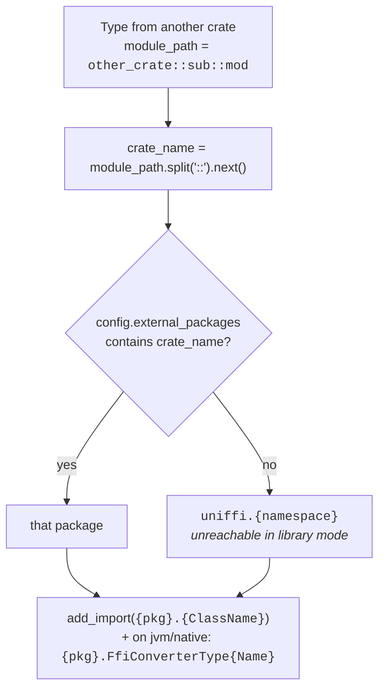
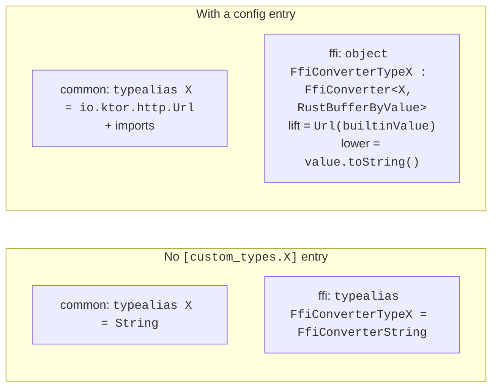

# External and remote types

Three distinct things get conflated under "external types". Keep them apart:

| Term | Means | Rust side | Kotlin side |
| --- | --- | --- | --- |
| **External type** | A uniffi type defined in *another crate that also uses uniffi*. | nothing special — just use it | resolved to that crate's Kotlin package and `import`ed |
| **Remote type** | A type from a crate that does **not** use uniffi (`url::Url`, `http::HeaderMap`, `std` types). Someone has to declare its shape. | `uniffi::use_remote_type!` / `custom_type!(…, { remote, … })` / `[Remote]` in UDL | either a normal generated type, or a custom type |
| **Custom type** | A newtype that travels as a builtin. | `uniffi::custom_type!` / `custom_newtype!` | a typealias, optionally with a configured Kotlin type + lift/lower expressions |

Fixtures: `tests/uniffi/ext-types/{ext-types,ext-types-proc-macro,custom-types,sub-lib,uniffi-one,simple,http-headermap}`,
plus `examples/custom-types`.

## 1. External types

### uniffi 0.29 removed `Type::External`

This is the single most important fact for anyone reading the generator. There is no longer a
`Type::External` variant — a type from another crate is an ordinary `Type::Record` /
`Type::Enum` / `Type::Object` / … and "externality" is a *query on the `ComponentInterface`*:

```rust
self.ci.is_external(inner_ty)                    // is this type from another crate?
self.ci.iter_local_types()                       // types this crate defines
self.ci.iter_external_types()                    // types it uses from elsewhere
self.ci.namespace_for_module_path(module_path)   // crate → namespace
```

Both `Types.kt` mega-loops are built on that split: `iter_local_types()` renders the type, then a
second loop over `iter_external_types()` renders `ExternalTypeTemplate.kt`.

### Resolving a crate to a Kotlin package



`external_type_package_name` / `external_type_name` / `external_type_package` are the three
helpers on the type renderer (`gen_kotlin_multiplatform/mod.rs`); they exist because the old
`Type::External` variant used to carry `name` and `namespace` directly and the template still
needs both.

> Since uniffi 0.31 `module_path` is a **full path**, not just the crate name — hence the
> `.split("::").next()`. `external_packages` is keyed by crate name.

### Where `external_packages` comes from

`KotlinBindingGenerator::update_component_configs` (`bindgen/src/lib.rs`) fills it in
automatically. After defaulting each component's `package_name`, it builds a
`crate_name → package_name` map over **all** components in the generation run and inserts every
entry a component does not already have:

```
Adding external package mapping for crate {ext_crate} to package {ext_package}, for component {crate}
```

That message on stdout during `buildBindings` is normal. A `uniffi.toml`
`[external_packages]` entry overrides it — needed when the other crate's bindings were generated
in a separate build with a non-default package name.

In **library mode** all dependencies are visible in one run, so the `uniffi.{namespace}` fallback
is unreachable. In UDL mode, or with `--metadata-no-deps`, it can be reached.

### What is emitted

`ExternalTypeTemplate.kt`, three variants:

**commonMain** — one import, nothing else. The type itself is declared by the other crate's own
generated `commonMain`:

```kotlin
{{ self.add_import("{package}.{ClassName}") }}
```

**jvmMain / androidMain / nativeMain** — the import, the other crate's `FfiConverter`, and a
`RustBuffer` alias:

```kotlin
internal typealias RustBufferUniffiOneType       = uniffi.runtime.RustBuffer
internal typealias RustBufferUniffiOneTypeByValue = uniffi.runtime.RustBufferByValue
```

**headers** (`generic/headers/Types.h`) — the C counterpart:

```c
typedef RustBuffer RustBufferUniffiOneType;
```

### Why the `RustBuffer{Name}` aliases exist

An external type crosses the FFI in a `RustBuffer`, but the FFI function signature names *that
crate's* `RustBuffer` type. On the C side these are all the same struct; the aliases exist so the
generated declarations match the header, and so Kotlin/Native's cinterop sees the same type name
the header declares.

The decision is in `KotlinCodeOracle::ffi_type_label`:

```rust
// uniffi 0.32 attaches external metadata to *every* record/enum, so a bare
// `Some(..)` no longer means "external" -- compare crate names instead.
FfiType::RustBuffer(maybe_external) => match maybe_external {
    Some(external_meta) if external_meta.crate_name() != ci.crate_name() =>
        format!("RustBuffer{}", external_meta.name),
    _ => "RustBuffer".to_string(),
},
```

That comment is a live trap: matching on `Some(_)` alone — which is what pre-0.32 code did —
now marks *every* record and enum external and produces `RustBufferFoo` aliases for local types.

The same test recurs in `filters::async_complete`, which re-wraps the completed value of an async
function whose return type belongs to another crate:

```kotlin
{ future, continuation ->
    UniffiLib.INSTANCE.ffi_…_rust_future_complete_rust_buffer(future, continuation)
        .let { RustBufferUniffiOneUDLTraitByValue(it.capacity, it.len, it.data) }
}
```

Note the suffix uses the **raw** name, not `class_name` — the typealias is declared as
`RustBuffer{name}`, so `UniffiOneUDLTrait` must not become `UniffiOneUdlTrait`.

### Serialization opt-out

`is_serializable` / `is_variant_serializable` reject a record whose field type is
`ci.is_external(...)`, or an object, callback interface or custom type — the annotation would
need the other module's type to be serializable too.

> Read the loop before relying on it: the inner `match` has `_ => return true`, so it returns on
> the **first** inner type of the **first** field and never inspects the rest. A record whose
> second field is external is still reported serializable. Pre-existing, not a port regression.

### Gradle side

Each crate is its own Gradle module with its own `uniffi.toml`. The consumer declares an ordinary
project dependency:

```kotlin
commonMain {
    dependencies {
        api(project(":tests:uniffi:ext-types:uniffi-one"))
        api(project(":tests:uniffi:ext-types:sub-lib"))
    }
}
```

`api`, not `implementation` — the external type appears in the consumer's public signatures.

`uniffi { generateBindingsForExternalCrates }` (default `false`) controls whether `--crate <name>`
is passed to the bindgen. Left at `false`, each module generates only its own crate's bindings and
imports the rest; set to `true`, a module regenerates its dependencies' bindings too, which
duplicates classes if those modules are also on the classpath.

### Init chaining (upstream #2343)

Each module has its own lazy `UniffiLib.INSTANCE`, so without help an external crate's callback
vtables would register only when *its* namespace is first touched from Kotlin — and a Rust-side call
through an unset vtable aborts the process rather than throwing.

`KotlinWrapper::initialization_fns()` (`gen_kotlin_multiplatform/mod.rs`) closes that: after mapping
`iter_local_types()` to their `initialization_fn()`s, it makes a second pass over
`iter_external_types()`, resolves each `module_path` to a package, and emits
`{package}.uniffiEnsureInitialized()`. Touching a namespace therefore forces every crate it uses to
register its vtables too. The generated `UniffiLib.INSTANCE` initialiser shows both passes — see
[deep-dive.md §3.3](deep-dive.md#33-registration).

On JVM and Android this composes with `UniffiVtableRegistry`, which installs each vtable into every
loaded library that links the declaring crate; on Kotlin/Native the equivalent guarantee is still
missing for a different reason — see
[deep-dive.md §7.4](deep-dive.md#74-why-kotlinnative-breaks-the-cell-symbol).

## 2. Remote types

A remote type is one whose Rust definition lives in a crate that knows nothing about uniffi. The
generator has no special support for them — **all of the work is on the Rust side**, and by the
time the bindgen sees the type it is an ordinary record/enum/object/custom type.

Three spellings, all present in the fixtures:

```rust
// (a) another uniffi crate exposed the type; re-use its definition here
uniffi::use_remote_type!(uniffi_kmm_example_custom_types::Url);

// (b) describe a foreign crate's type as a custom type
uniffi::custom_type!(HeaderMap, Vec<HttpHeader>, {
    remote,                       // required: HeaderMap is from another crate
    lower: |obj| { … },
    try_lift: |val| { … },
});
```

```webidl
// (c) describe a foreign crate's type structurally, in UDL
[Remote]
dictionary ExternalCrateDictionary { string sval; };

[Remote]
interface ExternalCrateInterface { string value(); };

[Remote, NonExhaustive]
enum ExternalCrateNonExhaustiveEnum { "One", "Two" };
```

Migration note for consumers coming from 0.28: `use_udl_record!`, `use_udl_enum!`,
`use_udl_object!` and `ffi_converter_forward!` are **gone**. `use_remote_type!` replaces them, and
a type defined in a third-party crate but described in your UDL needs `[Remote]`.

## 3. Custom types

Rust declares the builtin a custom type travels as; `uniffi.toml` optionally declares what it
becomes in Kotlin.

```toml
[custom_types.Url]
type_name = "io.ktor.http.Url"     # the Kotlin type
imports = ["io.ktor.http.Url"]     # imports it needs
into_custom = "Url({})"            # builtin → Kotlin   (alias: lift)
from_custom = "{}.toString()"      # Kotlin  → builtin  (alias: lower)
```

`{}` is substituted with the expression (`CustomTypeConfig::lift` / `lower` in `mod.rs`). uniffi
0.29.1 renamed `into_custom`/`from_custom` to `lift`/`lower`; both spellings are accepted, with
`lift`/`lower` winning when non-empty.



Templates: `generic/common/CustomTypeTemplate.kt` (the typealias + imports) and
`generic/ffi/CustomTypeTemplate.kt` (the converter, wrapping the builtin's converter on all five
methods).

`CustomCodeType` (`gen_kotlin_multiplatform/custom.rs`) is thin: `type_label` is the class name,
`canonical_name` is `Type{Name}`, and `default()` delegates to the builtin's.

### Known gap: defaults under a `type_name` override

`CustomCodeType::default()` delegating to the builtin is correct while the custom type is a
typealias *to* its builtin. With `type_name` set it is a different Kotlin class, and the builtin's
default is rendered against it:

```kotlin
var `v`: ExampleCustomType = "abc"
public typealias ExampleCustomType = kotlin.ULong
// e: Initializer type mismatch: expected 'ULong', actual 'String'.
```

It fails loudly at Kotlin compile time and upstream has the identical hole, which is why it was
left alone. Full analysis — including why no correct default can be written today, and why a bare
`#[uniffi(default)]` fails too — is in `.claude/uniffi-0.32-update.md`. Reachable only via
proc-macros; UDL rejects defaults on custom types earlier.

## 4. Checklist

- Never test "is this external" by matching `FfiType::RustBuffer(Some(_))` — compare crate names.
  0.32 attaches external metadata to every record and enum.
- `external_packages` is keyed by **crate name**; `module_path` is a full path since 0.31.
- The `RustBuffer{Name}` suffix uses the raw type name, never `class_name`.
- A new external-type emission has to land in four places: `common/`, `android+jvm/`, `native/`
  `ExternalTypeTemplate.kt` and `headers/Types.h`.
- Remote types need no generator change — if one is not working, the missing piece is a
  `use_remote_type!`, a `remote` in `custom_type!`, or a `[Remote]` attribute in UDL.
