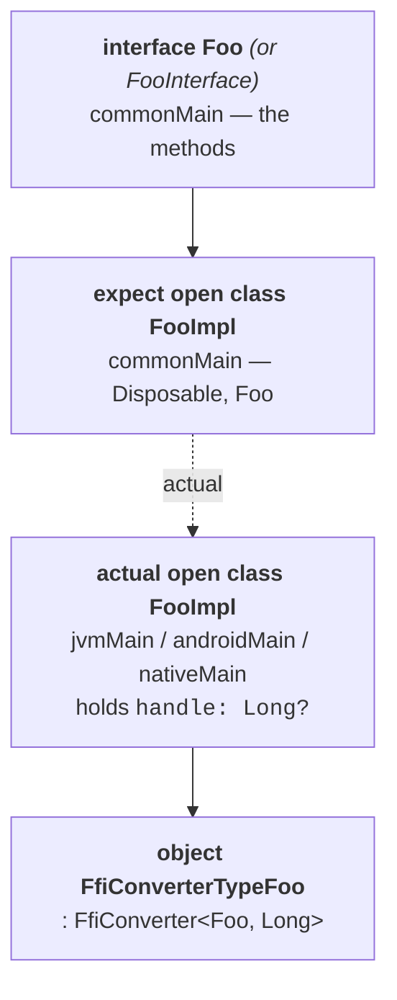
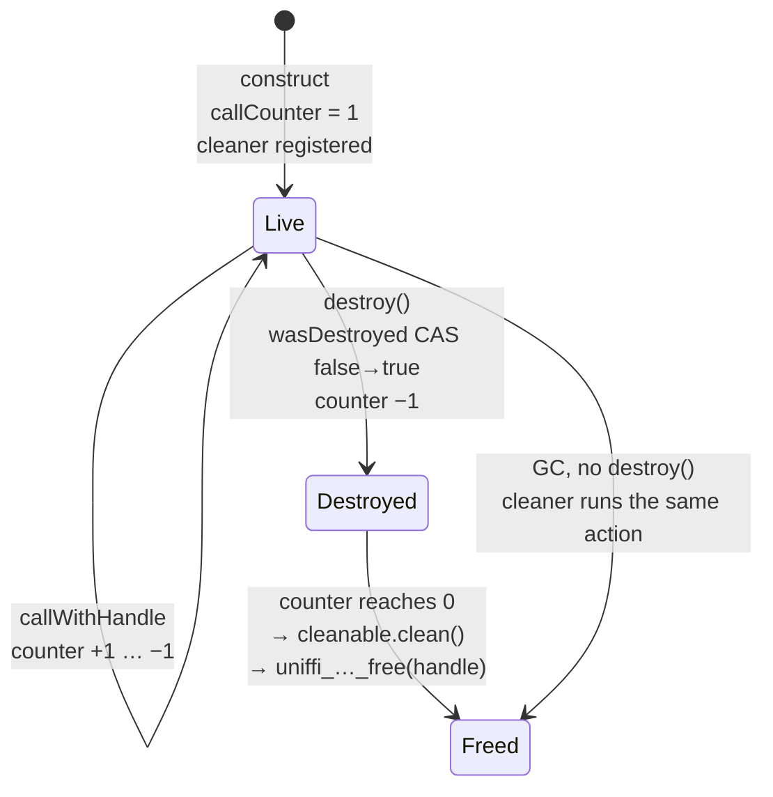
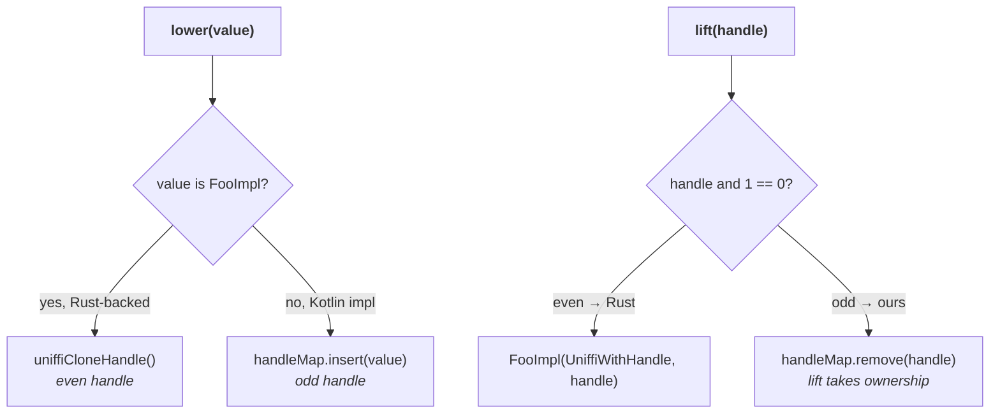

# Handles (formerly pointers)

## What changed in uniffi 0.30

An object used to cross the FFI as a `RustArcPtr` — a raw pointer to an `Arc`. Since uniffi 0.30
it crosses as an **opaque 64-bit handle**.

| | 0.28 | 0.32 (now) |
| --- | --- | --- |
| `FfiType` | `RustArcPtr` | `FfiType::Handle` |
| Kotlin type | `Pointer` | `Long` |
| C type | `void *` | `int64_t` |
| Direction | Rust → foreign only | bidirectional for trait interfaces |

The mapping is in `KotlinCodeOracle` (`bindgen/src/gen_kotlin_multiplatform/mod.rs`):

```rust
FfiType::Handle => "Long".to_string(),          // ffi_type_label
FfiType::Handle => "int64_t".to_string(),       // ffi_type_label_header
FfiType::Handle => "0.toLong()".to_owned(),     // ffi_default_value
```

`FfiType::VoidPointer` still exists and still maps to `Pointer`, which is why the
`is_pointer_type` filter matches **only** `VoidPointer`. Its doc comment spells out the trap:

> uniffi 0.30 turned object references from `RustArcPtr` into an opaque `u64` `Handle`, which
> cinterop maps straight to `Long` — so handles deliberately do *not* belong here any more.

If a handle ever starts getting wrapped in `Pointer` on Kotlin/Native, this filter is where it
went wrong.

## The generated object class

Every exported Rust object produces three things:



`KotlinCodeOracle::object_names()` decides which name is the interface and which is the class:

- **plain object** → interface `FooInterface`, class `Foo`
- **trait interface** (`has_callback_interface()`) → interface `Foo`, class `FooImpl`

This split decides what `FfiConverter.lower()` accepts: for a trait interface it must accept
anything implementing the interface (including a Kotlin implementation); for a plain object only
the concrete class.

### Constructors

```kotlin
constructor(uniffiWithHandle: UniffiWithHandle, handle: Long)  // wrap an existing Rust handle
constructor(noHandle: NoHandle)                                // fake, for tests; handle = null
constructor(<user args>)                                       // the Rust primary constructor
```

`UniffiWithHandle` is a marker object. Without it the internal wrapping constructor takes a bare
`Long` and could collide with a user-defined single-`Long` constructor. `NoHandle` (renamed from
`NoPointer` in commit `2786016`) builds an instance with `handle = null` for test fakes — any
real call through it fails.

Both markers, plus `Disposable` and `use`, are declared in the generated `common/Types.kt` rather
than imported from `uniffi.runtime`, so the runtime does not become part of a binding's public
ABI.

## Lifetime: call counter + cleaner

Kotlin has no destructors, so an object's Rust-side `Arc` is released by a combination of an
explicit `destroy()` and a GC-driven cleaner. The mechanism lives in
`templates/generic/ffi/ObjectTemplate.kt`.

```kotlin
protected val handle: Long?
protected val cleanable: UniffiCleaner.Cleanable
private val wasDestroyed = atomic(false)
private val callCounter  = atomic(1L)   // the 1 is "not yet destroyed"
```



`callWithHandle` is the guard around every method call:

```kotlin
internal actual inline fun <R> callWithHandle(block: (handle: Long) -> R): R {
    do {
        val c = this.callCounter.value
        if (c == 0L) throw IllegalStateException("… already been destroyed")
        if (c == Long.MAX_VALUE) throw IllegalStateException("… call counter would overflow")
    } while (!this.callCounter.compareAndSet(c, c + 1L))
    try {
        return block(this.uniffiCloneHandle())
    } finally {
        if (this.callCounter.decrementAndGet() == 0L) cleanable.clean()
    }
}
```

Two things to notice:

1. **The block receives a *cloned* handle, not the stored one.** `uniffiCloneHandle()` calls
   `uniffi_…_clone(handle)`, which bumps the Rust-side `Arc`. Ownership of that clone passes to
   the callee. The counter prevents the object being freed mid-call; the clone means the callee
   holds its own reference regardless.
2. **The free action is a static inner class**, `UniffiCleanAction(handle)`, deliberately not a
   closure — a closure would capture `this` and the object could never become unreachable.

### Cleaners per platform

| Platform | Implementation |
| --- | --- |
| JVM / Android | `java.lang.ref.Cleaner`, falling back to `com.sun.jna.internal.Cleaner` on `ClassNotFoundException` |
| Native | `kotlin.native.ref.createCleaner`, wrapped in `OnceRunnable` (an atomic `didRun` flag) so an explicit `clean()` followed by GC does not double-free |

Both are in `runtime/src/{jvmMain,androidMain,nativeMain}/kotlin/uniffi/runtime/ObjectCleanerHelper.kt`;
the native one is duplicated as a template at `templates/generic/native/ObjectCleanerHelper.kt`.

The per-library cleaner is a lazy singleton on `UniffiLib.CLEANER`, emitted only when
`ci.contains_object_types()`.

## The converter

```kotlin
public object FfiConverterTypeFoo : FfiConverter<Foo, Long> {
    override fun lower(value: Foo): Long = (value as FooImpl).uniffiCloneHandle()
    override fun lift(value: Long): Foo = FooImpl(UniffiWithHandle, value)
    override fun read(buf: ByteBuffer) = lift(buf.getLong())
    override fun allocationSize(value: Foo) = 8UL
    override fun write(value: Foo, buf: ByteBuffer) { buf.putLong(lower(value)) }
}
```

Handles are always 8 bytes in a `RustBuffer` — "the Rust code always writes handles as 8 bytes,
and will fail to compile if they don't fit."

**Lowering clones.** Passing an object to Rust hands over an owned reference; the Kotlin object
keeps its own. **Lifting takes ownership** of the handle it is given.

## Trait interfaces: handles in both directions

A trait interface can be implemented on either side, so a handle arriving from Rust may be
either a Rust object or one of *our* objects coming home. They are told apart by the **lowest
bit**:

> Foreign handles always have the lowest bit set; Rust handles never do.

`UniffiHandleMap` enforces that by construction
(`runtime/.../HandleMap.kt`, mirrored in `templates/generic/ffi/HandleMap.kt`):

```kotlin
private const val UNIFFI_HANDLEMAP_INITIAL = 1L
private const val UNIFFI_HANDLEMAP_DELTA   = 2L
```

Starting at 1 and stepping by 2 keeps every handle it hands out odd. (Starting at 1 also avoids
producing a null pointer in Kotlin/Native's `interpretCPointer`.)



`handleMap.remove` rather than `get` on the lift path is deliberate: lifting takes ownership, so
leaving the entry in the map would leak it.

### The vtable

For a Kotlin implementation, Rust calls back through a vtable of C function pointers, built in
`templates/generic/{android+jvm,native}/CallbackInterfaceImpl.kt`:

```kotlin
internal val vtable = UniffiVTableCallbackInterfaceFoo(
    uniffiFree,     // handleMap.remove(handle)
    uniffiClone,    // handleMap.clone(handle)  → a second odd handle to the same object
    method1, method2, …
)
internal fun register(lib: UniffiLib) { lib.uniffi_…_init_callback_vtable_foo(vtable) }
```

> **Field order is part of the ABI.** uniffi 0.30 moved `free` from last to first and added
> `clone` right after it, ahead of the interface methods.

`register` is wired in via `CodeType::initialization_fn()`
(`gen_kotlin_multiplatform/{object,callback_interface}.rs`), collected by
`KotlinWrapper::initialization_fns()`, and called from the lazy `UniffiLib.INSTANCE` initializer.

### Plain callback interfaces

A `callback interface` (as opposed to a trait interface) is Kotlin-only, so there is no
bidirectional case and the converter is the simpler
`FfiConverterCallbackInterface<T> : FfiConverter<T, Long>` from
`templates/generic/ffi/CallbackInterfaceRuntime.kt` — `lower` = `handleMap.insert`,
`lift` = `handleMap.get`, with `drop` exposed for the vtable's free.

## Other handle-shaped things

`UniffiHandleMap` is used for three unrelated purposes; they are separate map instances and only
share the odd-handle discipline:

| Map | Holds | Where |
| --- | --- | --- |
| `FfiConverterTypeFoo.handleMap` | Kotlin implementations of a trait/callback interface | per interface |
| `uniffiContinuationHandleMap` | `CancellableContinuation<Byte>` while a Rust future is polled | `Async.kt` |
| `uniffiForeignFutureHandleMap` | `Job` for an in-flight async callback method | `Async.kt` |

Rust futures themselves are also 64-bit handles (`rustFuture: Long`), but they are not managed by
a handle map — see [async.md](async.md).

## Checklist when touching this

- Handles are `Long` / `int64_t`. Do not add `FfiType::Handle` to `is_pointer_type`.
- Anything inserted into a `UniffiHandleMap` must come back out exactly once — `remove` on lift
  and on vtable free, `get` only where ownership stays put.
- Vtable field order must match the Rust struct: `free`, `clone`, then methods in declaration
  order.
- `wasDestroyed` / `callCounter` are **atomicfu** (`.value`, `.compareAndSet`), not
  `java.util.concurrent.atomic`. The upstream `uniffiIsDestroyed` accessor over that flag is
  present: `expect val` in `common/ObjectTemplate.kt`, `actual val … get() = wasDestroyed.value`
  in `ffi/ObjectTemplate.kt`.
- A method call takes a **clone**; the object keeps its own handle. Removing the clone would
  free the object out from under Kotlin as soon as the callee drops its argument.
