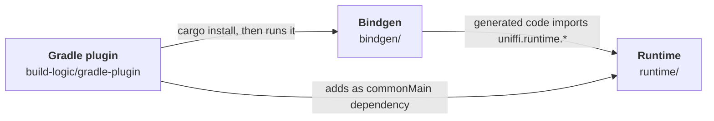
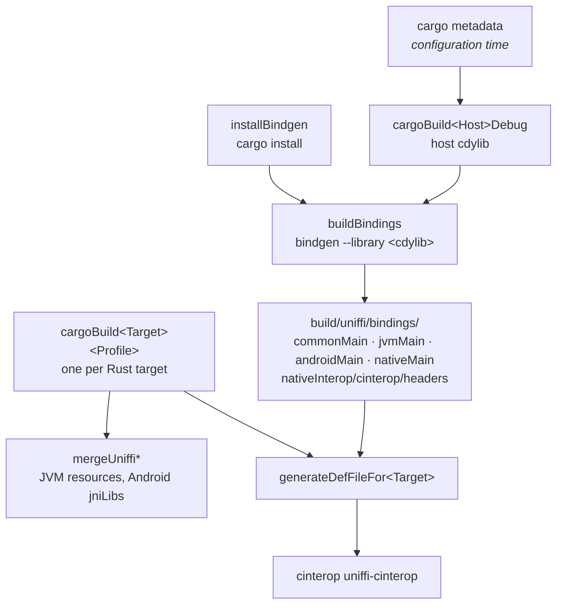

# Architecture

## Three components



| Component     | Responsibility                                                                                                                                                                                                                                                                                                                                                                                                            |
| ------------- | ------------------------------------------------------------------------------------------------------------------------------------------------------------------------------------------------------------------------------------------------------------------------------------------------------------------------------------------------------------------------------------------------------------------------- |
| Gradle plugin | Installs the bindgen, builds the Rust crate per target, runs the bindgen, and wires generated sources, headers and libraries into the Kotlin source sets.                                                                                                                                                                                                                                                                 |
| Bindgen       | A `uniffi_bindgen::BindingGenerator` plus askama templates. Writes Kotlin for four source sets and C headers.                                                                                                                                                                                                                                                                                                             |
| Runtime       | Kotlin shared by every crate, plus a small Rust library of its own. That library allocates every `RustBuffer` Kotlin passes to Rust, so a buffer can go to any crate. This is what makes multi-module builds work. In addition, the common code lives here too: `FfiConverter`, `RustBuffer`, `UniffiHandleMap`, the cleaner, the async helpers, converters for primitive types. Published as `ch.ubique.uniffi:runtime`. |

The plugin and the runtime are released together with the same version. The bindgen is installed
from source by `cargo install`, see [Gradle plugin](gradle-plugin.md#installing-the-bindgen).

## The build pipeline



1. **Configuration.** The plugin runs `cargo metadata` to find the package and library name and
   Cargo's target directory.
2. **Generate.** `installBindgen` installs the generator. A debug build of the crate for the host
   produces a dynamic library, and `buildBindings` runs the generator on it in UniFFI's
   _library mode_: the interface description is read from metadata embedded in the binary. With
   `generateFromUdl`, the UDL file is passed instead and the host build is skipped.
3. **Compile Rust per target.** One `cargoBuild<Target><Profile>` task per Rust target, building a
   dynamic library for JVM/Android and a static library for Kotlin/Native.
4. **Wire.** The generated directories are added as Kotlin source dirs. Dynamic libraries are merged
   into one directory tree for JVM resources or Android `jniLibs`. For each native target, a
   `.def` file points cinterop at the static library and the generated headers.

In debug builds, the host build in step 2 and the JVM build for the host in step 3 are the same
task, so the crate is not compiled twice. Details are in [Gradle plugin](gradle-plugin.md).

## Generated source sets

For a crate with namespace `ns`, the bindgen writes:

```
build/uniffi/bindings/
├── commonMain/kotlin/<package>/ns.common.kt
├── jvmMain/kotlin/<package>/ns.jvm.kt
├── androidMain/kotlin/<package>/ns.android.kt
├── nativeMain/kotlin/<package>/ns.native.kt
└── nativeInterop/cinterop/headers/
    ├── ns/ns.h
    └── common/common.h
```

The split follows one constraint: **only the platform source sets can call Rust**. The FFI library
object (`UniffiLib`) is a JNA `Library` on JVM/Android and a set of cinterop functions on Native,
so it can't exist in `commonMain`.

| Declaration                                         | `commonMain`                                          | Platform source sets                           |
| --------------------------------------------------- | ----------------------------------------------------- | ---------------------------------------------- |
| Top-level functions                                 | `expect fun`                                          | `actual fun` with the FFI call                 |
| Objects                                             | `interface FooInterface` + `expect open class Foo`    | `actual open class Foo`, `FfiConverterTypeFoo` |
| Records, enums, errors                              | the full `data class` / `enum class` / `sealed class` | `FfiConverterType…`                            |
| Methods on records and enums                        | member function calling an `internal expect fun` shim | `actual` shim with the FFI call                |
| Callback interfaces                                 | `interface Foo`                                       | vtable, `FfiConverterTypeFoo`                  |
| `Disposable`, `use`, `NoHandle`, `UniffiWithHandle` | declared in the generated file                        | —                                              |

Records are not `expect` classes, because a `data class` needs to be declared in full to keep `copy`
and `componentN` available in common code. That is why their methods go through a shim.

`Disposable` and the marker objects are declared per package rather than imported from the
runtime. Every generated object implements `Disposable`, so importing it from the runtime would make
the runtime part of every binding's public API.

The plugin adds `-Xexpect-actual-classes` to the whole project, because `expect`/`actual` classes
are still a Beta feature in Kotlin.

## JVM and Android share a template

`jvmMain` and `androidMain` are rendered from the same templates (`templates/generic/android+jvm/`).
The template is rendered twice, with identical output, and written to both source sets. The plugin adds JNA
as a jar on the JVM and as an `aar` on Android.

## One call, end to end

```kotlin
add(2, 2)
```

1. `commonMain` declares `expect fun add(a: Int, b: Int): Int`.
2. The JVM `actual` lowers each argument with its `FfiConverter`, and calls
   `UniffiLib.INSTANCE.uniffi_<crate>_fn_func_add(a, b, status)` inside `uniffiRustCall`.
3. JNA calls the `extern "C"` scaffolding function that `#[uniffi::export]` generated in Rust.
4. Rust writes the result and a `RustCallStatus`. `uniffiRustCall` throws if the status reports an
   error. Otherwise the result is lifted back into a Kotlin value.

The first access to `UniffiLib.INSTANCE` loads the library, checks the contract version and
checksums, and registers callback vtables. See [Objects and handles](objects-and-handles.md)
for calls on objects, and [Async](async.md) for `suspend` functions.
