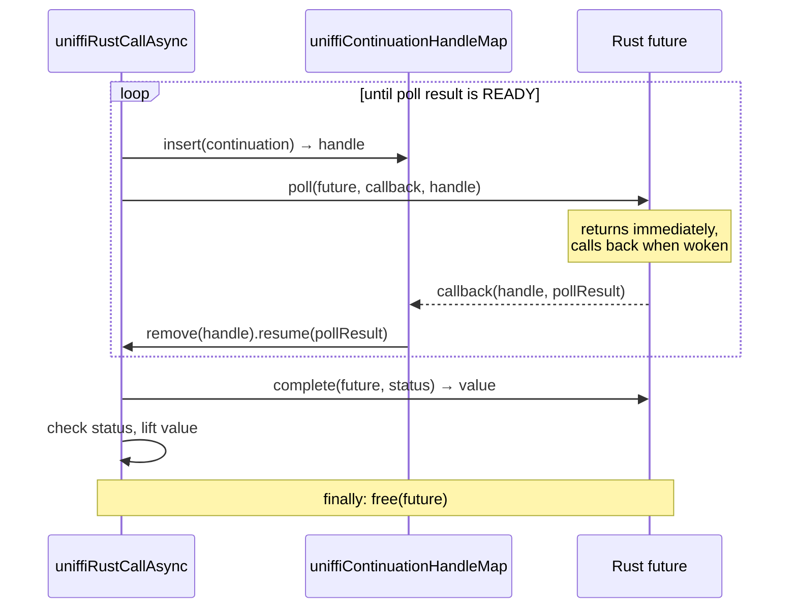
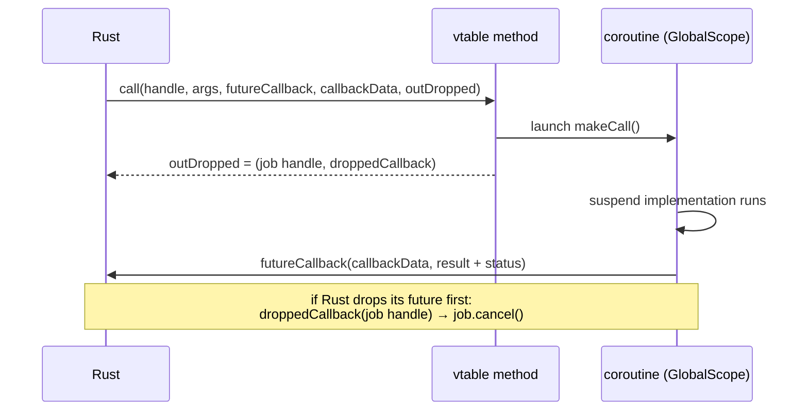

# Async

Async crosses the FFI in both directions:

- **Rust future → Kotlin `suspend`**: Kotlin drives a Rust future by polling it.
- **Kotlin `suspend` → Rust future**: an async callback method implemented in Kotlin is handed to
  Rust as a *foreign future*.

Both use `kotlinx.coroutines`. The helpers live in the runtime,
`runtime/src/{jvmMain,androidMain,nativeMain}/kotlin/uniffi/runtime/Async.kt`.

## Rust future → `suspend fun`

An async scaffolding function doesn't return a value. It returns a **future handle**. Four more FFI
functions per return type drive the future:

```
ffi_<crate>_rust_future_poll_<type>(future, continuation_callback, continuation_handle)
ffi_<crate>_rust_future_complete_<type>(future, status) -> value
ffi_<crate>_rust_future_cancel_<type>(future)
ffi_<crate>_rust_future_free_<type>(future)
```

The `call_async` macro in `macros.kt` generates a call to the runtime's `uniffiRustCallAsync`:

```kotlin
override suspend fun sayAfter(ms: UShort, who: String): String =
    uniffiRustCallAsync(
        UniffiLib.INSTANCE.uniffi_futures_fn_func_say_after(lower(ms), lower(who)),  // the future
        { future, callback, continuation -> UniffiLib.INSTANCE.ffi_futures_rust_future_poll_rust_buffer(future, callback, continuation) },
        { future, status -> UniffiLib.INSTANCE.ffi_futures_rust_future_complete_rust_buffer(future, status) },
        { future -> UniffiLib.INSTANCE.ffi_futures_rust_future_free_rust_buffer(future) },
        { future -> UniffiLib.INSTANCE.ffi_futures_rust_future_cancel_rust_buffer(future) },
        { FfiConverterString.lift(it) },
        UniffiNullRustCallStatusErrorHandler,
    )
```

The four lambdas come from the `async_poll`, `async_complete`, `async_free` and `async_cancel`
filters in `mod.rs`. For a method on an object, the call that creates the future is wrapped in
`callWithHandle`. Once the future exists it holds its own reference to the object.

### The poll loop



- The loop runs inside `withContext(Dispatchers.IO)`, because `complete` is a blocking call.
- The continuation is passed to Rust as a handle in `uniffiContinuationHandleMap`, not as a
  pointer. On Native the callback is a `staticCFunction`, which can't capture anything, so the
  continuation has to be found through a global map.
- Poll results: `0` is ready, `1` means "maybe ready", so poll again.
- `continuation.invokeOnCancellation { cancel(future) }` propagates coroutine cancellation to Rust.
- `free(future)` runs in a `finally`, after success, error and cancellation.

## Kotlin `suspend` → Rust future

An `async` method of a callback or trait interface can't block the Rust thread that calls it. Its
vtable entry starts a coroutine and returns immediately. Rust passes in a completion callback, and
gets back a handle plus a "dropped" callback:



The runtime helpers are `uniffiTraitInterfaceCallAsync` and `uniffiTraitInterfaceCallAsyncWithError`.
Running jobs are kept in `uniffiForeignFutureHandleMap`.

`GlobalScope` is deliberate. The parent of the coroutine is a Rust future, so Kotlin's structured
concurrency can't express the relationship anyway. The dropped callback restores it: when Rust
drops the future, the coroutine is cancelled.

The result struct is `ForeignFutureResult<Type>` (value plus `RustCallStatus`). These structs and
the callback types are in `FFI_BUILTINS`, so they are declared once in `common.h`
(see [Bindgen](bindgen.md#headers)).

## Things to keep in mind

- The coroutine imports (`suspendCancellableCoroutine`, `GlobalScope`, `Dispatchers`, …) are added
  by each `Types.kt` template when `ci.has_async_fns()`. A new coroutine API used in generated code
  must be added there too.
- `reject_async_borrowed_bytes` refuses `&[u8]` arguments on async callables. The borrow would end
  when the future handle is returned, while the future is still running.
- For a return type from another crate, `async_complete` re-wraps the value into that crate's
  `RustBuffer<Name>ByValue` alias (see [External and remote types](external-and-remote-types.md)).
- `tests/uniffi/futures` contains timing-based tests. The first Tokio-based call starts the Tokio
  runtime, which is slow, so the test class warms it up in `@BeforeTest`.
