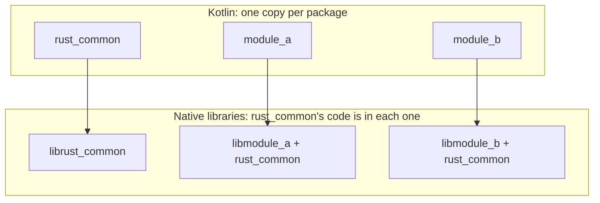

# External and remote types

Three related things, kept apart:

| Term | Meaning | Who does the work |
| --- | --- | --- |
| **External type** | a UniFFI type defined in another UniFFI crate | the bindgen: import it from that crate's package |
| **Remote type** | a type from a crate that doesn't use UniFFI, like `url::Url` | Rust only (`custom_type!` with `remote`, `use_remote_type!`, `[Remote]` in UDL) |
| **Custom type** | a type that crosses as a builtin | Rust, plus optionally `[custom_types]` in `uniffi.toml` |

Remote types need no generator support. By the time the bindgen sees one, it is an ordinary
record, enum, object or custom type. If a remote type doesn't work, the problem is on the Rust side.

## External types in the generator

Since UniFFI 0.29 there is no `Type::External`. A type from another crate is an ordinary
`Type::Record`, `Type::Enum` or `Type::Object`. Whether it is external is a query on the
`ComponentInterface`:

```rust
ci.is_external(ty)
ci.iter_local_types()      // types this crate defines
ci.iter_external_types()   // types this crate uses from others
```

The `Types.kt` templates render every local type, and include `ExternalTypeTemplate.kt` for every
external one.

### Which package

`Config::external_package_name(module_path, namespace)` takes the crate name (the first segment of
the `module_path`, which is a full module path since UniFFI 0.31) and looks it up in
`external_packages`. That map is filled automatically in `update_component_configs` from all
crates in the generation run. Entries from `uniffi.toml` take precedence. The fallback
`uniffi.<namespace>` is only reachable in UDL mode.

### What is emitted

| Output | For an external type `Foo` from package `other` |
| --- | --- |
| `commonMain` | `import other.Foo` |
| `jvmMain` / `androidMain` / `nativeMain` | `import other.Foo`, `import other.FfiConverterTypeFoo`, the error handler if it's an error, and `typealias RustBufferFoo = uniffi.runtime.RustBuffer` (plus `…ByValue`) |
| header | `typedef RustBuffer RustBufferFoo;` |

The aliases exist because UniFFI gives FFI signatures that carry another crate's type a distinct
`RustBuffer` type name. On the C side they are all the same struct. The aliases make the Kotlin
declarations match the headers. The suffix is the raw type name, not the Kotlin class name.

A new kind of external emission has to go into four templates:
`generic/{common,android+jvm,native}/ExternalTypeTemplate.kt` and `generic/headers/Types.h`.

!!! warning "Testing for externality"
    Don't check `FfiType::RustBuffer(Some(_))` to find external types. UniFFI 0.32 attaches that
    metadata to **every** record and enum. Compare `external_meta.crate_name()` with
    `ci.crate_name()`, as `KotlinCodeOracle` does.

### Initialisation order

Each namespace has its own lazy `UniffiLib.INSTANCE`. Its initialiser calls
`<package>.uniffiEnsureInitialized()` for every crate whose types it uses (`initialization_fns()`
in `mod.rs`), so that crate's callback vtables are registered first. See
[Callbacks](callbacks.md#registration).

## Multi-module builds

In a [multi-module project](../guide/features/multi-module.md), each Gradle module runs the
bindgen with `--crate <own crate>`. It generates Kotlin only for its own crate, and imports
everything else through the mechanism above. Because the other module is a Gradle dependency,
its classes are on the classpath. The result: one Kotlin class per Rust type, shared by all modules.

On the native side, each module builds its own library, and Rust links the shared crate into each of
them:



What this means:

- **Records and enums** are serialised on every crossing, so it doesn't matter which library
  reads them.
- **Objects** are `Arc` pointers. `rust_common.TestObject`'s methods always go through
  `librust_common`, even when the object was created by `libmodule_b`. That works because every
  copy of the crate's code is identical and all libraries share the process allocator. The modules
  must be built from the same version of the shared crate.
- **`RustBuffer`s** are allocated by the runtime's library (see [Runtime](runtime.md)) and freed by
  whichever library receives them. This relies on the shared allocator too.
- **Foreign callback vtables** are per library, so they break: see
  [Callbacks](callbacks.md#multi-module-limitation).

For Kotlin/Native all static libraries end up in one binary, with the shared crate's symbols in
several archives. Apple's linker keeps the first definition. `lld` (Linux) and the MinGW linker
refuse, which is why `GenerateDefFileTask` adds `--allow-multiple-definition` there.

`generateBindingsForExternalCrates = true` drops `--crate`, so a module generates Kotlin for every
UniFFI crate in its library. That is the right choice for a single module that wraps a third-party
UniFFI crate, but it produces duplicate classes as soon as two modules do it for the same crate.

## Custom types

`CustomCodeType` (`custom.rs`) is thin: the type label is the custom type's name, and the converter
wraps the builtin's converter.

- Without a `[custom_types.<Name>]` entry, `common/CustomTypeTemplate.kt` emits
  `typealias Name = <builtin Kotlin type>`, and `ffi/CustomTypeTemplate.kt` aliases the builtin's
  converter.
- With an entry, the typealias points at `type_name`, the `imports` are added, and the converter
  applies the `lift` / `lower` expressions (`{}` is replaced with the value) around the builtin's
  converter.
- `default()` renders the builtin's default and wraps it in the `lift` expression when a config entry
  exists.
