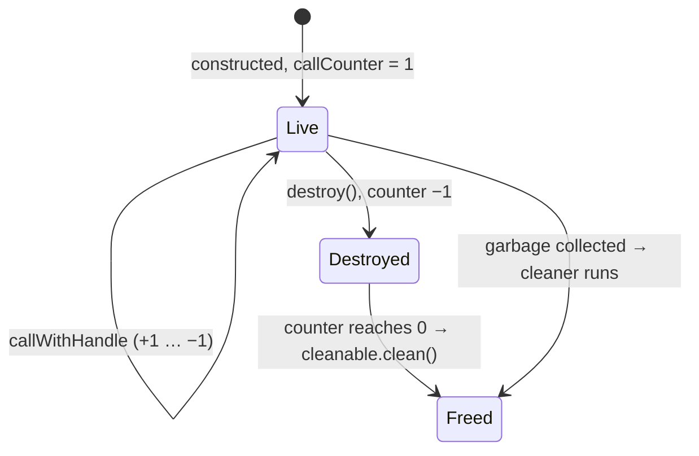

# Objects and handles

## What Rust exports

For an object `Counter` in crate `my_crate`, the scaffolding exports flat C functions. There is no
object model on the C side:

```
uint64_t uniffi_my_crate_fn_constructor_counter_new(int32_t start, RustCallStatus*);
uint64_t uniffi_my_crate_fn_clone_counter(uint64_t handle, RustCallStatus*);
void     uniffi_my_crate_fn_free_counter(uint64_t handle, RustCallStatus*);
int32_t  uniffi_my_crate_fn_method_counter_increment(uint64_t handle, RustCallStatus*);
```

The **handle** is an opaque 64-bit integer, derived from an `Arc<Counter>` pointer. `clone` adds a
strong reference, `free` drops one, and every method takes the handle as its first argument. In
Kotlin a handle is a `Long`, in the C headers an `int64_t`.

## What the bindgen generates

```kotlin
// commonMain
interface CounterInterface { fun increment(): Int }
expect open class Counter : Disposable, CounterInterface { ... }

// jvmMain / androidMain / nativeMain
actual open class Counter : Disposable, CounterInterface {
    protected val handle: Long?
    protected val cleanable: UniffiCleaner.Cleanable
    private val wasDestroyed = atomic(false)
    private val callCounter = atomic(1L)
    ...
}
object FfiConverterTypeCounter : FfiConverter<Counter, Long>
```

Templates: `generic/common/ObjectTemplate.kt` (the `expect` class), `generic/common/Interface.kt`
(the interface), `generic/ffi/ObjectTemplate.kt` (the `actual` class and the converter). The
interface/class naming is decided by `KotlinCodeOracle::object_names()`.

Every class has three constructors:

```kotlin
constructor(uniffiWithHandle: UniffiWithHandle, handle: Long)  // wrap a handle that came from Rust
constructor(noHandle: NoHandle)                                // a fake without a Rust object
constructor(start: Int)                                        // the Rust `new` constructor, if any
```

`UniffiWithHandle` is a marker parameter. Without it, the internal constructor would take a bare
`Long` and could clash with a user constructor with one `Long` argument.

## A method call

```kotlin
actual override fun increment(): Int =
    FfiConverterInt.lift(
        callWithHandle { handle ->
            uniffiRustCall { status ->
                UniffiLib.INSTANCE.uniffi_my_crate_fn_method_counter_increment(handle, status)
            }
        }
    )
```

`callWithHandle` does two things:

1. It increments `callCounter` with a compare-and-set loop, and throws `IllegalStateException` if
   the counter is already `0`, which means the object was destroyed.
2. It passes **a clone** of the handle to the block (`uniffiCloneHandle()`), not the stored handle.
   The Rust scaffolding takes ownership of the handle it receives and drops it at the end of the
   call. Passing the stored handle would free the object after one call.

Afterwards it decrements the counter, and runs the cleanup if it reached zero.

## Lifetime



- The initial count of `1` stands for "not destroyed yet". `destroy()` flips `wasDestroyed` with a
  compare-and-set (so it only counts once) and removes that `1`. Whoever brings the counter to `0`,
  `destroy()` or the last running call, frees the Rust object.
- `close()` is `destroy()` under a lock. `use { }` calls `destroy()` in a `finally`.
- The cleanup action is `UniffiCleanAction(handle)`, a static nested class. A lambda would capture
  `this`, so the object could never become unreachable and the cleaner would never run.
- Counters and flags use `kotlinx.atomicfu`, because the code is shared with Kotlin/Native.

The cleaner is created once per library (`UniffiLib.CLEANER`) and depends on the platform, see
`runtime/src/*/kotlin/uniffi/runtime/ObjectCleanerHelper.kt`:

| Platform | Cleaner |
| --- | --- |
| JVM | `java.lang.ref.Cleaner`, falling back to JNA's cleaner |
| Android | `android.system.SystemCleaner` on API 34+, JNA's cleaner below |
| Native | `kotlin.native.ref.createCleaner`, wrapped so the action runs at most once |

## The converter

```kotlin
object FfiConverterTypeCounter : FfiConverter<Counter, Long> {
    override fun lower(value: Counter): Long = value.uniffiCloneHandle()
    override fun lift(value: Long): Counter = Counter(UniffiWithHandle, value)
    override fun read(buf: ByteBuffer): Counter = lift(buf.getLong())
    override fun write(value: Counter, buf: ByteBuffer) = buf.putLong(lower(value))
    override fun allocationSize(value: Counter) = 8UL
}
```

Lowering clones, because Rust takes ownership of what it receives while the Kotlin object keeps its
own reference. Lifting takes ownership of the handle Rust returned. Inside a `RustBuffer` (an
object in a record or list) a handle always takes 8 bytes.

## Trait interfaces

For a `with_foreign` trait, a handle can come from either side: a Rust implementation, or a Kotlin
implementation registered in a handle map (see [Callbacks](callbacks.md)). The lowest bit tells
them apart. Rust handles are always even, since they come from aligned pointers. Kotlin handles
are always odd, because `UniffiHandleMap` starts at 1 and counts in steps of 2.

```kotlin
override fun lower(value: Greeter): Long =
    if (value is GreeterImpl) value.uniffiCloneHandle()   // Rust object: clone its handle
    else handleMap.insert(value)                          // Kotlin object: register it

override fun lift(value: Long): Greeter =
    if (value and 1L == 0L) GreeterImpl(UniffiWithHandle, value)  // from Rust
    else handleMap.remove(value)                                  // our own object, coming back
```

`lift` uses `remove` rather than `get`, because lifting takes ownership. Leaving the entry would
leak it.

## Records and enums with methods

Records and enums are not handles: the receiver of a method is serialised into a `RustBuffer`
like any other argument. Because a record is a plain `data class` in `commonMain`, which can't
reach `UniffiLib`, each method delegates to an `internal expect fun` named after the FFI symbol:

```kotlin
// commonMain
data class Greeting(var text: String) {
    fun shout(): String = uniffiSelfCall_uniffi_my_crate_fn_method_greeting_shout(this)
}
internal expect fun uniffiSelfCall_uniffi_my_crate_fn_method_greeting_shout(uniffiSelf: Greeting): String

// platform source sets
internal actual fun uniffiSelfCall_uniffi_my_crate_fn_method_greeting_shout(uniffiSelf: Greeting): String =
    FfiConverterString.lift(uniffiRustCall { status ->
        UniffiLib.INSTANCE.uniffi_my_crate_fn_method_greeting_shout(
            FfiConverterTypeGreeting.lower(uniffiSelf), status)
    })
```

The FFI symbol is unique across the library, so the shim names can't collide. The macros are
`self_shim_*` and `self_method_decl` in `macros.kt`.

## Failure modes

| Symptom | Usual cause |
| --- | --- |
| `IllegalStateException: … already been destroyed` | call after `destroy()` / `use { }` |
| `InternalException: UniffiHandleMap: Invalid handle` | a handle removed twice, or `remove` where `get` was correct |
| crash in Rust after a Kotlin change to object code | handle not cloned before passing it, so Rust freed the object |
